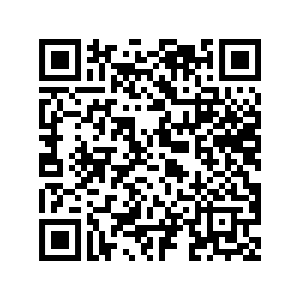
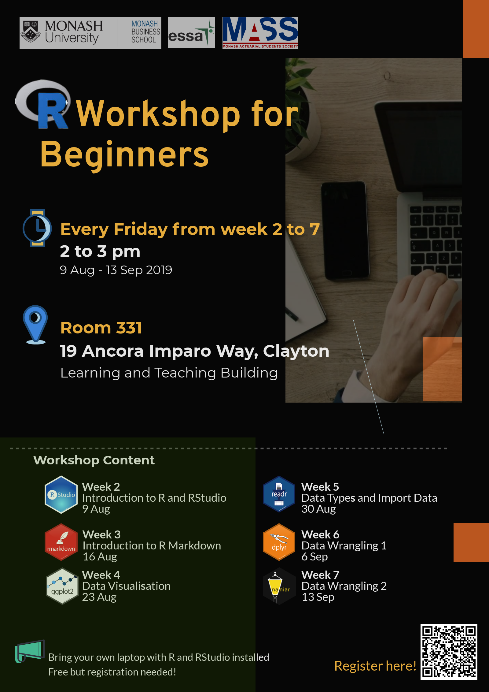

```{r setup, include = FALSE}
knitr::opts_chunk$set(
  collapse = TRUE,
  message = FALSE,
  echo = FALSE,
  fig.path = "images/",
  fig.align="center"
)
```

# R Workshops for Beginners

Advisers : 

* [Dianne Cook](http://dicook.org)

* [Patricia Menéndez](https://www.patriciamenendez.com)

Organizers : 

* Jiaying Wu

* Yijia Pan

## Workshop Contents:

* Workshop 1 - Introduction to R and RStudio (9 August)
     
     * Speaker: [Dianne Cook](http://dicook.org)

* Workshop 2 - Introduction to R Markdown (16 August)

* Workshop 3 - Data Visualization (23 August)

* Workshop 4 - Data Types and Import Data (30 August)

     * Speaker: [Earo Wang](https://earo.me)

* Workshop 5 - Data Wrangling 1 (6 September)

     * Speaker: [Mitchell O'Hara-Wild](https://www.mitchelloharawild.com)

* Workshop 6 - Data Wrangling 2 (13 September)


([R script to neatly align hexagon stickers](https://github.com/mitchelloharawild/hexwall), by Mitchell O'Hara-Wild)

## Time and Location

* Date: Every Friday from Week 2 to 7

* Time: 2 to 3 pm

* Location: Room 331, 19 Ancora Imparo Way, Clayton (Learning and Teaching Building)   

```{r fig.height= 4,fig.width=6}
library(magrittr)
library(leaflet)
map <- leaflet() %>%
  addTiles()%>%
  addMarkers(lng = 145.132480, lat = -37.913697, popup = "Location for R Workshops") %>%
  setView(lng = 145.132480, lat = -37.913697, zoom = 16.5) %>%
  fitBounds(lng1 = 145.132480-0.003, lng2 = 145.132480+0.003, lat1 = -37.913697-0.001, lat2 = -37.913697+0.001)
map
```

```{r eval=FALSE}
library(mapview)
mapshot(map, file = "Map.png")
```

## Sign up

**Scan** the QR code to sign up:

{width="40%" height="40%"}

Or **click** this [**link**](https://docs.google.com/forms/d/1umPW5ooUfOoKhLB-5ehamH9tKTphBEtyc5G6EXfYpN8/viewform?edit_requested=true).

## Installation

**Please install R and RStudio before you attend the workshop**.

* [Install R](https://cran.csiro.au)

* [Install RStudio](https://www.rstudio.com/products/rstudio/download/)

## Poster for R Workshops

