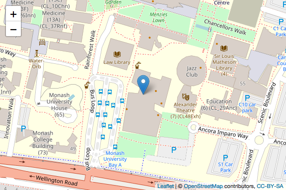

```{r setup, include = FALSE}
knitr::opts_chunk$set(
  collapse = TRUE,
  message = FALSE,
  echo = FALSE,
  fig.path = "images/",
  fig.align="center"
)
```

# R Workshops for Beginners

#### Short link to the website: http://bit.ly/MonashBA_R2

**Advisers** : [Dianne Cook](http://dicook.org), [Patricia Menéndez](https://research.monash.edu/en/persons/patricia-menendez-galvan)

**Organizers** : Jiaying Wu, Yijia Pan

**Guest speakers** : [Earo Wang](https://earo.me), [Mitchell O'Hara-Wild](https://www.mitchelloharawild.com)

**Helpers:** 

<table>
<tr>
    <td>Amy Tran</td>
    <td>David Kontrobarsky</td>
    <td>Dun Yong Tan</td>
    <td>Geethanjali Gangula</td>
</tr>
<tr>
    <td>James Louis Nguyen</td>
    <td>Jefanny Suryawan</td>
    <td>Rachell Ng</td>
    <td>Rowina Nathan</td>
</tr>
<tr>
    <td>Sayani Gupta</td>
    <td>Sao Yang Hew</td>
    <td>Sherry Zhang</td>
    <td>Thi Minh Chau Nguyen</td>
</tr>
<tr>
    <td>Weihao Li</td>
    <td>William Tran</td>
    <td>Yih Ting Eng</td>
    <td>Yuru Sun</td>
</tr>
<tr>
    <td>Zhuangyi Zhu</td>
    <td>Zihui Li</td>
</tr>
</table>
<br>

```{r eval=FALSE}
tb <- tibble::tibble(
  c("Amy Tran", "David Kontrobarsky", "Dun Yong Tan", "Geethanjali Gangula"),
  c("James Louis Nguyen", "Jefanny Suryawan", "Rachell Ng","Rowina Nathan"),
  c("Sao Yang Hew", "Thi Minh Chau Nguyen", "Weihao Li", "William Tran"),
  c("Yih Ting Eng", "Yuru Sun", "Zhuangyi Zhu", "Zihui Li"))

colnames(tb) <- NULL

knitr::kable(tb)
```


## Workshop Contents

* Workshop 1 - [Introduction to R and RStudio (9 August)](https://ebsmonash.shinyapps.io/workshop1_intro/)
     
     * Speaker: [Dianne Cook](http://dicook.org)
     
     * Download slides: <a href="workshop1/workshop1_intro.Rmd" download="workshop1_intro.Rmd">Rmd</a>

* Workshop 2 - [Introduction to R Markdown (16 August)](https://ebsmonash.shinyapps.io/workshop2_rmarkdown/)
     
     * Speaker: Jiaying Wu
     
     * Download slides: <a href="workshop2/workshop2_rmarkdown.Rmd" download="workshop2_rmarkdown.Rmd">Rmd</a>

* Workshop 3 - [Data Visualisation (23 August)](https://ebsmonash.shinyapps.io/workshop3_datavisualisation/)

     * Speaker: Yijia Pan
     
     * Download slides: <a href="workshop3/workshop3_datavisualisation.Rmd" download="workshop3_datavisualisation.Rmd">Rmd</a>
     
     * Download data: <a href="workshop3/data/chocolates.csv" download="chocolates.csv">chocolates.csv</a>

* Workshop 4 - [Data Types and Import Data (30 August)](https://ebsmonash.shinyapps.io/workshop4_datatype/)

     * Speaker: [Earo Wang](https://earo.me)
     
     * Download slides: <a href="workshop4/workshop4_datatype.Rmd" download="workshop4_datatype.Rmd">Rmd</a>
     
     * Download data: 
     
     <table>
     <tr>
     <td><a href="workshop4/data/CO2.tsv" download="CO2.tsv">CO2.tsv</a></td>
     <td><a href="workshop4/data/datasets.csv" download="datasets.csv">datasets.csv</a></td>
     <td><a href="workshop4/data/deaths.xlsx" download="deaths.xlsx">deaths.xlsx</a></td>
     <td><a href="workshop4/data/geometry.xlsx" download="geometry.xlsx">geometry.xlsx</a></td>
     <td><a href="workshop4/data/iris.csv" download="iris.csv">iris.csv</a></td>
     </tr>
     <tr>
     <td><a href="workshop4/data/mtcars.dta" download="mtcars.dta">mtcars.dta</a></td>
     <td><a href="workshop4/mtcars.sas7bdat" download="mtcars.sas7bdat">mtcars.sas7bdat</a></td>
     <td><a href="workshop4/mtcars.sav" download="mtcars.sav">mtcars.sav</a></td>
     <td><a href="workshop4/rock.csv" download="rock.csv">rock.csv</a></td>
     </tr>
     </table>
<br>

* Workshop 5 - Data Wrangling 1 (6 September)

     * Speaker: [Mitchell O'Hara-Wild](https://www.mitchelloharawild.com)
     
     * Download slides

* Workshop 6 - Data Wrangling 2 (13 September)

     * Speakers: David Kontrobarsky, Geethanjali Gangula, William Tran
     
     * Download slides


([R script to neatly align hexagon stickers](https://github.com/mitchelloharawild/hexwall), by Mitchell O'Hara-Wild)

## Time and Location

* Date: Every Friday from Week 2 to 7

* Time: 2 to 3 pm

* Location: Room 331, 19 Ancora Imparo Way, Clayton (Learning and Teaching Building)   

```{r eval=FALSE}
library(magrittr)
library(leaflet)
map <- leaflet() %>%
  addTiles()%>%
  addMarkers(lng = 145.132480, lat = -37.913697, popup = "Location for R Workshops") %>%
  setView(lng = 145.132480, lat = -37.913697, zoom = 16.5) %>%
  fitBounds(lng1 = 145.132480-0.003, lng2 = 145.132480+0.003, lat1 = -37.913697-0.001, lat2 = -37.913697+0.001)
map
```

```{r eval=FALSE}
library(mapview)
mapshot(map, file = "Map.png")
```

{width="50%" height="50%"}


## Resources

#### Online Books

- [R for Data Science](https://r4ds.had.co.nz/)

- [R Programming for Data Science](https://bookdown.org/rdpeng/rprogdatascience/)

- [Advanced R](https://adv-r.hadley.nz/)

- [R Markdown: The Definitive Guide](https://bookdown.org/yihui/rmarkdown/)

- [Fundamentals of Data Visualization](https://serialmentor.com/dataviz/)

- [Data Visualization: A practical introduction](https://socviz.co)

- [ggplot2: Elegant Graphics for Data Analysis](https://ggplot2-book.org)

#### RStudio Resources

- [RStudio Cheatsheets](https://www.rstudio.com/resources/cheatsheets/)

- [Data Science Essntials](https://resources.rstudio.com/the-essentials-of-data-science)

- [RStudio webinars](https://github.com/rstudio/webinars)

- [RStudio community](https://community.rstudio.com)

- [R Markdown form R Studio](https://rmarkdown.rstudio.com/lesson-1.html)


#### Other Resources

- [useR! 2018 beginners tutorial: RCurious](https://www.youtube.com/watch?v=AmqxVDlfKQY)

- [R Markdown form R Studio](https://rmarkdown.rstudio.com/lesson-1.html)

- [R-bloggers](https://www.r-bloggers.com)


## Installation

**Please install R and RStudio before you attend the workshop**.

* [Install R](https://cran.csiro.au)

* [Install RStudio](https://www.rstudio.com/products/rstudio/download/)


## Sign up

**Scan** the QR code to sign up:

{width="40%" height="40%"}

Or **click** this [**link**](https://docs.google.com/forms/d/1umPW5ooUfOoKhLB-5ehamH9tKTphBEtyc5G6EXfYpN8/viewform?edit_requested=true).


## Poster for R Workshops


