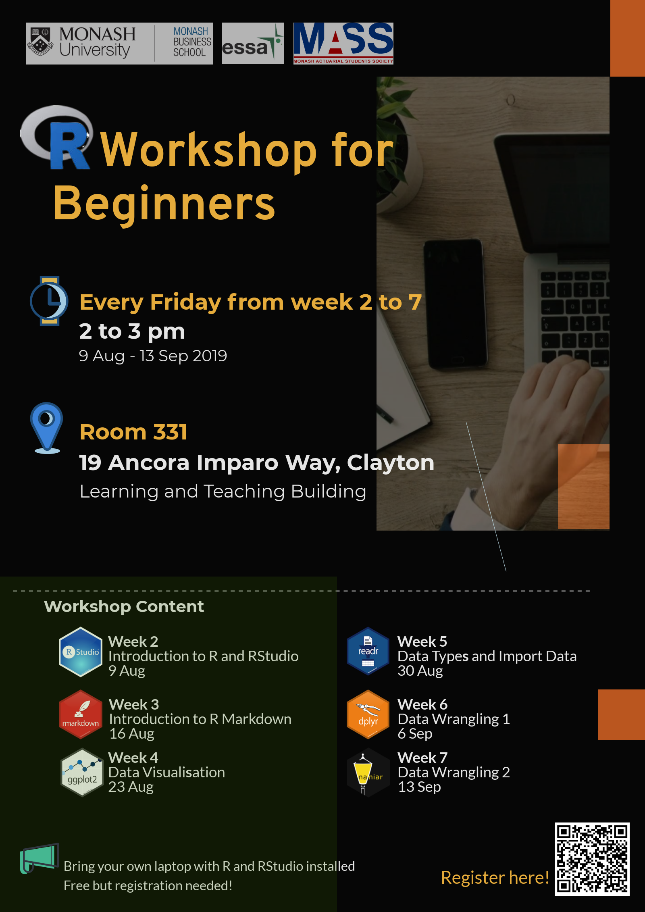

# R Workshops for Beginners

* Workshop 1 - Introduction to R and RStudio (9 August)

   * Speaker : Dianne Cook

* Workshop 2 - Introduction to R Markdown (16 August)

* Workshop 3 - Data Visualization (23 August)

   * Speaker : Patricia Menéndez

* Workshop 4 - Data Types and Import Data (30 August)

   * Speaker : Earo Wang

* Workshop 5 - Data Wrangling 1 (6 September)

   * Speaker : Mitchell O'Hara-Wild

* Workshop 6 - Data Wrangling 2 (13 September)

## Time and Location

* Date: 9 August - 13 September 2019

* Time: 2 to 3 pm

* Location: Room 331, 19 Ancora Imparo Way, Clayton (Learning and Teaching Building)   

