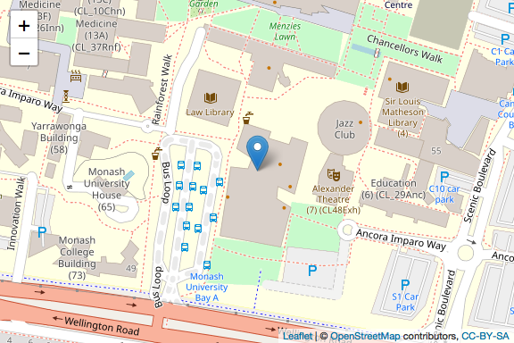

# R Workshops for Beginners

Advisers :

  - [Dianne Cook](http://dicook.org)

  - [Patricia Menéndez](https://www.patriciamenendez.com)

Organizers :

  - Jiaying Wu

  - Yijia Pan

## Workshop Contents:

  - Workshop 1 - Introduction to R and RStudio (9 August)
    
      - Speaker: [Dianne Cook](http://dicook.org)

  - Workshop 2 - Introduction to R Markdown (16 August)

  - Workshop 3 - Data Visualization (23 August)

<<<<<<< HEAD
    -   Speaker: Jiaying Wu

-   Workshop 3 - Data Visualization (23 August)

    -   Speaker: Yijia Pan

-   Workshop 4 - Data Types and Import Data (30 August)
=======
  - Workshop 4 - Data Types and Import Data (30 August)
    
      - Speaker: [Earo Wang](https://earo.me)

  - Workshop 5 - Data Wrangling 1 (6 September)
    
      - Speaker: [Mitchell
        O’Hara-Wild](https://www.mitchelloharawild.com)
>>>>>>> 5e1cff6dbfbee9cbe210810450da3449d71b9f6f

  - Workshop 6 - Data Wrangling 2 (13 September)

([R script to neatly align hexagon
stickers](https://github.com/mitchelloharawild/hexwall), by Mitchell
O’Hara-Wild)

## Time and Location

  - Date: Every Friday from Week 2 to 7

  - Time: 2 to 3 pm

  - Location: Room 331, 19 Ancora Imparo Way, Clayton (Learning and
    Teaching
Building)

## Sign up

**Scan** the QR code to sign up:

Or **click** this
[**link**](https://docs.google.com/forms/d/1umPW5ooUfOoKhLB-5ehamH9tKTphBEtyc5G6EXfYpN8/viewform?edit_requested=true).

## Installation

**Please install R and RStudio before you attend the workshop**.

  - [Install R](https://cran.csiro.au)

  - [Install
    RStudio](https://www.rstudio.com/products/rstudio/download/)

## Poster for R Workshops

