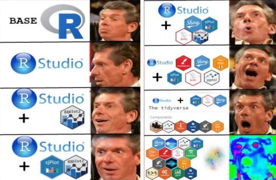
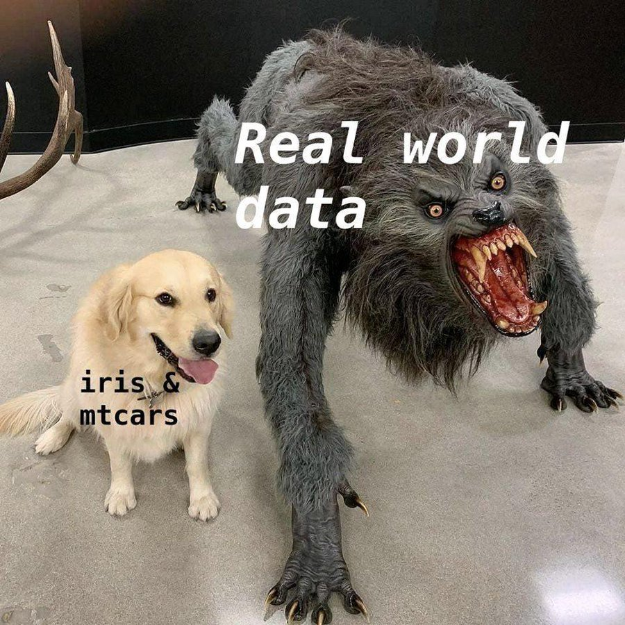

```{r setup, include=FALSE}
library(learnr)
knitr::opts_chunk$set(echo = TRUE,   
                      message = FALSE,
                      warning = FALSE,
                      collapse = TRUE,
                      fig.height = 4,
                      fig.width = 6,
                      fig.align = "center",
                      cache = FALSE)
tutorial_html_dependency()

check_package <- function(package_name){
  if(!package_name %in% installed.packages())
    install.packages(package_name)
}

# Remove the # below will help you check and install the required pakckages.

#check_package("tidyverse")
#check_package("learnr")
#check_package("gridExtra")
#check_package("GGally")
#check_package("gapminder")
#check_package("lubridate")
#check_package("visdat")
#check_package("naniar")
#check_package("readxl")

#check_package("devtools")
#if(!"DSR" %in% installed.packages())
#    devtools::install_github("garrettgman/DSR")
```

## Introduction and set up

1. Enter the link into your web browser : http://bit.ly/MonashBA_R2

2. Go down to `Workshop Contents`, then click `Data Wrangling 2` to open the material of workshop

3. Download the csv files which are a part of the workshop

#### **Speakers**: David Kontrobarsky, Geethanjali Gangula, William Tran
#### **Helpers**:

* Amy Tran

* Jefanny Suryawan

* Jiaying Wu (Raymond)

* Sao Yang Hew

* Weihao Li

* Yuru Sun (Christina)
 
* Yih Ting Eng


## What are missing values?

{width=250px}

* Missing data occurs when certain values are missing in a dataset

* In R, missing values are indicated by 'NA'

* Missing values are essential to deal with as misleading results can be obtained if they are ignored 


There are several reasons as to why there may be missing values in dataset. For example:

* Manual data entry procedures

* Incorrect measurements

* Equipment errors


## Visualising Missing Data 

{width="15%" height="15%"}

### Types of missing data

```{r echo=FALSE}
library(tidyverse)
library(lubridate)

survey <- read_csv("data/survey.csv") %>% 
  rename(
    uni_year = `Q1.What year of uni are you in?`,
    degree_type = `Q2.Do you study a single or double degree?`,
    travel_method = `Q3.Do you use public or private transport?`,
    travel_time = `Q4.How long does it take to come to uni? (Enter the number of minutes, as a number only.)`,
    hours_facebook = `Q5.Hours on facebook per week?(Enter a number only)`,
    hours_twitter = `Q6.Hours on Twitter? (Enter a number only)`,
    favourite_sport = `Q7.What is your favourite sport?`,
    superpower = `Q8.If you could have a super power what would it be?`,
    own_pets = `Q9.What pets do you have?`,
    class_days = `Q10.Which day you need to attend the class?`,
    like_cheese = `Q11.I like cheese.`,
    see_ausopen = `Q12.Have you been to the Australian Open?`,
    shirt_sizes = `Q13.Would you rather your shirts be always two sizes too big or one size too small?`,
    read_books = `Q14.How many books did you read last year?`
  )

survey_tidy <- survey %>%
mutate(
    uni_year = factor(uni_year),
    degree_type = factor(degree_type),
    travel_method = factor(travel_method),
    see_ausopen = factor(see_ausopen),
    shirt_sizes = factor(shirt_sizes),
    read_books = ordered(read_books, levels = c("A. 0", "B. 1-5", "C. 6-10", "D. 10-20", "E. more than 20"))
  ) %>%
  mutate(
    travel_time = parse_number(travel_time),
    hours_twitter = parse_number(hours_twitter)
  ) 

survey_tidy1 <- survey_tidy %>%
  mutate(
    Timestamp = ymd_hms(Timestamp, tz = "Australia/Melbourne")
  ) %>%
  mutate(
    own_pets = str_split(own_pets, ";"),
    class_days = str_split(class_days, ";")
  )
```

```{r plot1,fig.height = 5,fig.width = 6}
library(visdat)
vis_dat(survey)
```

* This type of plot is called a "heatmap", displays the data table, with cells coloured according to some other information. In this case it is type of variable, and missingness status. 

* Most of the variables are `character` (text) variables and we can see that there is one `numeric` variables and one `logical` variable. 

### Using [`vis_dat()`](http://visdat.njtierney.com/reference/vis_dat.html)

After Mitch tidied the survey data from last week: 

```{r plot2,fig.height = 5,fig.width = 6}
vis_dat(survey_tidy)
```

### Using [`vis_miss()`](http://visdat.njtierney.com/reference/vis_miss.html)

```{r plot3,fig.height = 6,fig.width = 5}
vis_miss(survey)
```

* This type of plot exclusively tells us what values are missing and not

## Summarising and Manipulating Missing Data 

{width="15%" height="15%"}

[naniar](http://naniar.njtierney.com) is an important package which can summarise, visualise and manipulate missing data. 

It provides us with:

* a tidy structure for missing data

* shorthand and numerical summaries of missing data

* visualisation of missing data

### Summarising missing data

```{r}
library(naniar)
miss_summary(survey)
```

* `miss_df_prop` - The proportion of missings

* `miss_var_prop` - The proportion of variables with a missing

* `miss_case_prop` - The proportion of cases with $k$ missings

### Plotting missing data in ggplot2

ggplot gives us a warning if there are missing values. 

```{r plot4,warning=TRUE}
ggplot(survey_tidy,aes(x = uni_year, y = hours_facebook)) +
  geom_boxplot() + 
  theme(aspect.ratio=1) + 
  labs(x = "Uni Year", y = "Hours on Facebook")
```

[`geom_miss_point`](http://naniar.njtierney.com/reference/geom_miss_point.html) to display the missing data.

```{r plot5}
ggplot(survey_tidy, aes(x = uni_year,y = hours_facebook)) +
  geom_miss_point() + 
  theme(aspect.ratio=1) + 
  labs(x = "Uni Year", y = "Hours on Facebook")
```


## Your turn!

* Load the 'rentals' dataset

* Create a heatmap to identify the proportion of character and integer variables

* Make a vismiss plot and summarise the missing data


## Let's Review!

## Workshop 1 - Introduction to R and RStudio


<br>

**Credit to R memes for Statistical Fiends reddit page**

* Learnt about what is R and R studio and the benefits of learning R 
 
* Learnt how to create a project and what a working directory is 
 
* Learnt what R can do e.g. calc, creating objects, calling functions

```{r}
# Calculations
sin(pi / 6)
exp(2)
log(1)

#Create objects with 
a <- 9 * 7
4 * 8 -> b
c <- 128/2

Vector <- c(a,b,c)
mean(Vector)
sd(Vector)
```
 
* Learnt how to install and use packages and the help function

```{r eval=FALSE}
# CRAN most common method
install.packages("naniar")
library(naniar)
```
 

## Workshop 2 - Introduction to R Markdown

Learnt the format of an RMD file which includes...  

* YAML header 
  
```
---
title: "Workshop 6"
author: "R is cool""
date: "13/09/2019"
output: html_document
---
```
* Code Chunks 

  * Where R code is typed into
  
  * Shortcut for Win `Control + Alt + I`
  
  * Shortcut for Mac `Cmnd + Option + I`
 
  * The benefit of an RMD file is that it can be knitted into many different filte types i.e. HTML file, Word doc, PDF, presentation, web app etc.
 
  * Learnt how to add extra features such as heading, lists, creating different types of text


## Workshop 3 - Data Visualisation

{width="100%" height="100%"}
<br>

**Credit to R memes for Statistical Fiends reddit page**

* In Workshop 3 an introduction to data visualisation with the use of the ggplot function

* The basic framework is.. 

```{r eval = FALSE}
library(ggplot2)

ggplot(data = ???, aes(x = ???, y= ???)) + 
  geom_???()
```


### Histogram

```{r plot6}
ggplot(data = survey_tidy, aes(x = hours_facebook)) + 
  geom_histogram(binwidth=10) + 
  xlab("Facebook hours per week") +
  ylab("Number of people")
```

### Barchart

```{r plot7}
ggplot(data = survey_tidy, aes(x = uni_year)) + 
  geom_bar() + 
  xlab("Year Level") + 
  ylab("Number of people") + 
  ggtitle("What year of uni are you in?")
```

### Boxplot

```{r plot8}
ggplot(data = survey_tidy, aes(x = degree_type, y = hours_facebook)) + 
  geom_boxplot() 
```

### Scatterplot

```{r plot9}
library(gapminder)

ggplot(data = gapminder, aes(x = year, y= lifeExp, col= continent)) + 
  geom_point()
```

```{r plot10}
gapminder %>% 
  filter(continent == "Oceania") %>% 
  ggplot(aes(x=year,y=lifeExp, colour = country, size = pop)) + 
  geom_point()
```

If you're interested in this dataset have a look at [Hans Rosling's 200 Countries, 200 Years, 4 Minutes]  (https://www.youtube.com/watch?v=jbkSRLYSojo)


## Workshop 4 - Data Types and Import Data

* In Workshop 4 we learnt how to import and export different formats of data in R

* We did this with the readr, readxl and haven packages in R

* **readr** {width="8%" height="8%"}

* **readxl** {width="8%" height="8%"}

* **haven** {width="8%" height="8%"} 


* Some of the functions we used in that workshop were:

### [readxl](https://readxl.tidyverse.org/)

* read_xls() for reading xls files

* read_xlsx() reading xlsx files

### [readr](https://readr.tidyverse.org/)  

* read_csv() for reading csv files 

* read_tsv() for reading tab seperated data 

* read_fwf() for fixed width text files 
  

For example, this is an example of what raw csv data looks in a text editor
  

<br>

And this is what it looks like in R

```{r}
library(readr)
rock <- read_csv("data/rock.csv")
rock
```

We can do the same for an xlsx file

```{r}
library(readxl)
mortality <- read_xlsx("data/mortality.xlsx")
mortality
```

The Haven package allows us to read in datafiles from other statistical software like SAS, SPSS and STATA


## Workshop 5 - Data Wrangling

{width="50%" height="50%"}  
<br>

**Credit to R memes for Statistical Fiends reddit page**

Last week, in workshop 5 we learnt about data wrangling on the survey data. This is a key skill for analysts as most data in the real world doesn't come in the correct format. 

Mitch showed us two important packages

* dplyr

* tidyr
  
{width="15%" height="15%"}

The goal of `tidyr` is to **reshape** your **data** into **tidy** format.

1. Each variable is in a column.

2. Each observation is a row.

3. Each value is a cell.

The 4 functions in tidyr that we utlised were: 

* [gather()](https://tidyr.tidyverse.org/reference/gather.html)

* [spread()](https://tidyr.tidyverse.org/reference/spread.html)

* [seperate()](https://tidyr.tidyverse.org/reference/separate.html)

* [unite()](https://tidyr.tidyverse.org/reference/unite.html)
  
For example;


#### spread()

```{r eval=FALSE}
# devtools::install_github("garrettgman/DSR")
library(DSR)
library(tidyr)
library(dplyr)
```

```{r}
table2
```


```{r}
table2_tidy <- spread(table2, type, count)
table2_tidy
```


#### gather()

```{r}
DSR::table4
```

```{r}
gather(DSR::table4, "year","cases", 2:3)
```
<br>

{width="80%" height="80%"} 

<br>
<br>


{width="15%" height="15%"}


The functions we learnt about in dpylr:

* [rename()](https://dplyr.tidyverse.org/reference/rename.html)

* [mutate()](https://dplyr.tidyverse.org/reference/mutate.html)

* [filter()](https://dplyr.tidyverse.org/reference/filter.html)

* [arrange()](https://dplyr.tidyverse.org/reference/arrange.html)

* [summarise()](https://dplyr.tidyverse.org/reference/summarise.html)

* [group_by()](https://dplyr.tidyverse.org/reference/group_by.html)


Here's a quick example showing how a few of these functions work:

```{r}
table2_tidy %>% 
  rename(pop = population) %>% 
  mutate(cases_per_cap = cases/pop) %>% 
  filter(year == 1999) %>% 
  arrange(cases_per_cap) 
```


## Your Turn! 

1. Load the data into R (painters.csv)

* `read_csv()`
 
2. Explore the data

* `glimpse()`
 
3. Explore the `dplyr` and `tidyr` packages to tidy the data

4. Create plots to understand the dataset

* `ggplot()`
 
6. Knit the Rmd file into HTML
 


