```{r setup, include=FALSE}
library(learnr)
knitr::opts_chunk$set(echo = FALSE,   
                      message = FALSE,
                      warning = FALSE,
                      collapse = TRUE,
                      fig.height = 4,
                      fig.width = 6,
                      fig.align = "center",
                      cache = FALSE)
tutorial_html_dependency()
```

# Week of introduction

## Introduction to R

### What is {width="6%" height="6%"}? 

*A programming language for Data analysis.*

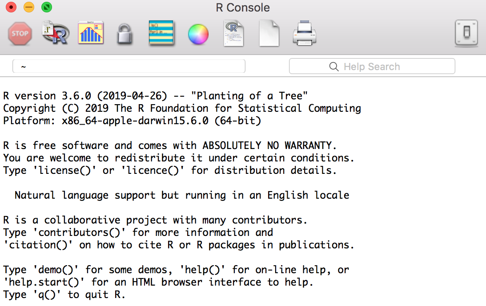{width="60%" height="60%"}


### Why {width="6%" height="6%"}?

```{r}
library(emo)
set.seed(2019)
```

* __Free__
* __Flexible__: Allows you to create your own solutions.

{width="30%" height="30%"}

* __Powerful__: Over 14400 contributed packages on [CRAN](https://cran.r-project.org/web/packages/), as of June 2019.
* __Community__: Large, lots of resources, friendly and Helpful. 


### It's a new language!

`r emo::ji("cartwheel")` Flexibility <--------> Complexity `r emo::ji("nervous")`

`r emo::ji("swim")` Ability to program <---------> Programming requirement `r emo::ji("scream")`

*It's taught to New Zealand high school students!* 


### Community tidbits

R Consortium conducted a survey of users 2017.

These are the locations of respondents to an R Consortium survey conducted in 2017.

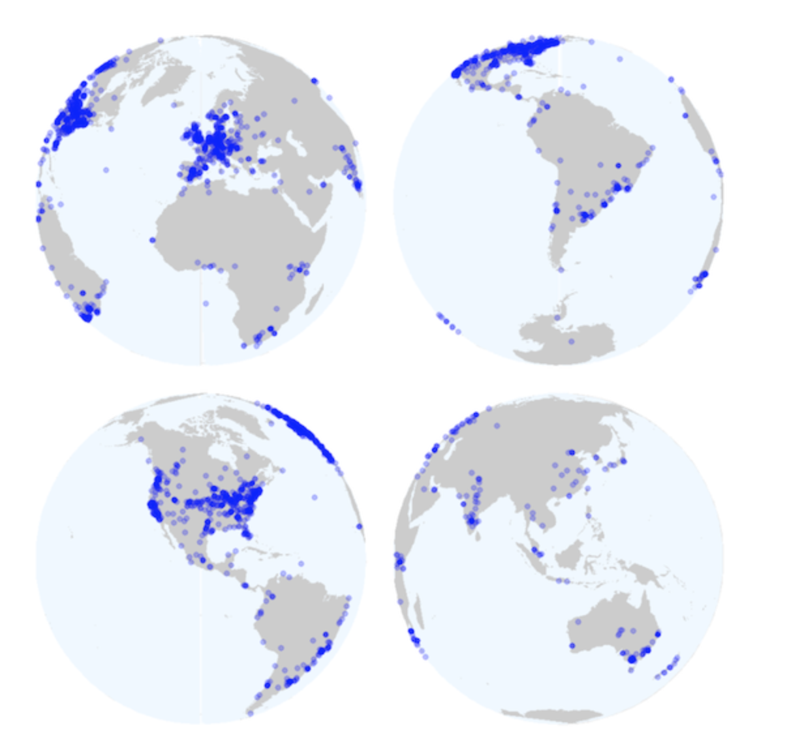{width="70%" height="70%"}

**8% of R users are between 18-24 BUT 45% of R users are between 25-34!**

Sample of Australian organisations/companies that sent employees to [useR! 2018](https://user2018.r-project.org): ABS, CSIRO, ATO, Microsoft, Energy Qld, Auto and General, Bank of Qld, BHP, AEMO, Google, Flight Centre, Youi, Amadeus Investment Partners,  Yahoo, Sydney Trains, Tennis Australia, Rio Tinto, Reserve Bank of Australia, PwC, Oracle, Netflix, NOAA Fisheries, NAB, Menulog, Macquarie Bank, Honeywell, Geoscience Australia, DFAT, DPI, CBA, Bank of Italy, Australian Red Cross Blood Service, Amazon, Bunnings.


## Introduction to RStudio

### What is {width="15%" height="15%"}?

An integrated development environment for R.

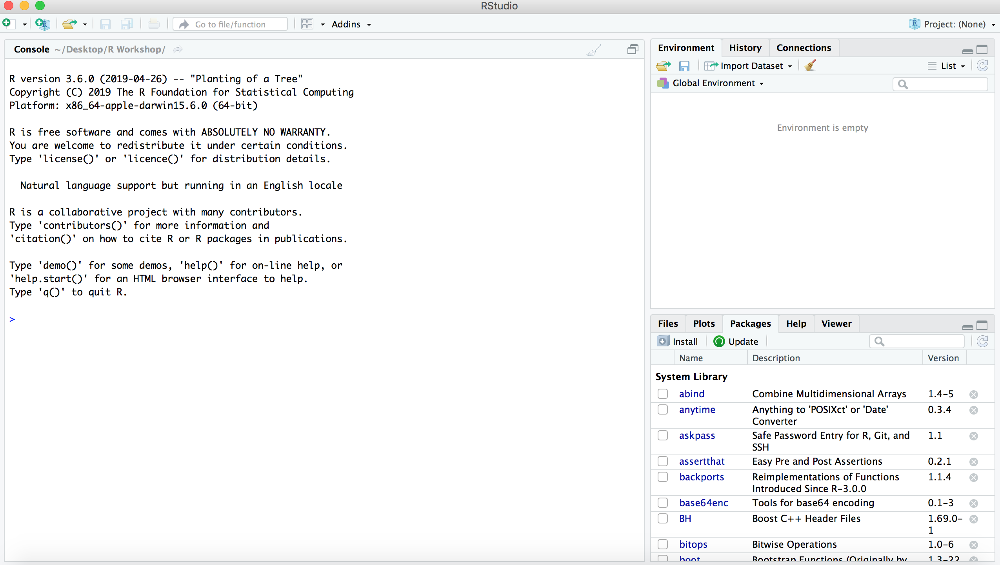{width="70%" height="70%"}


### What the difference between R and RStudio?

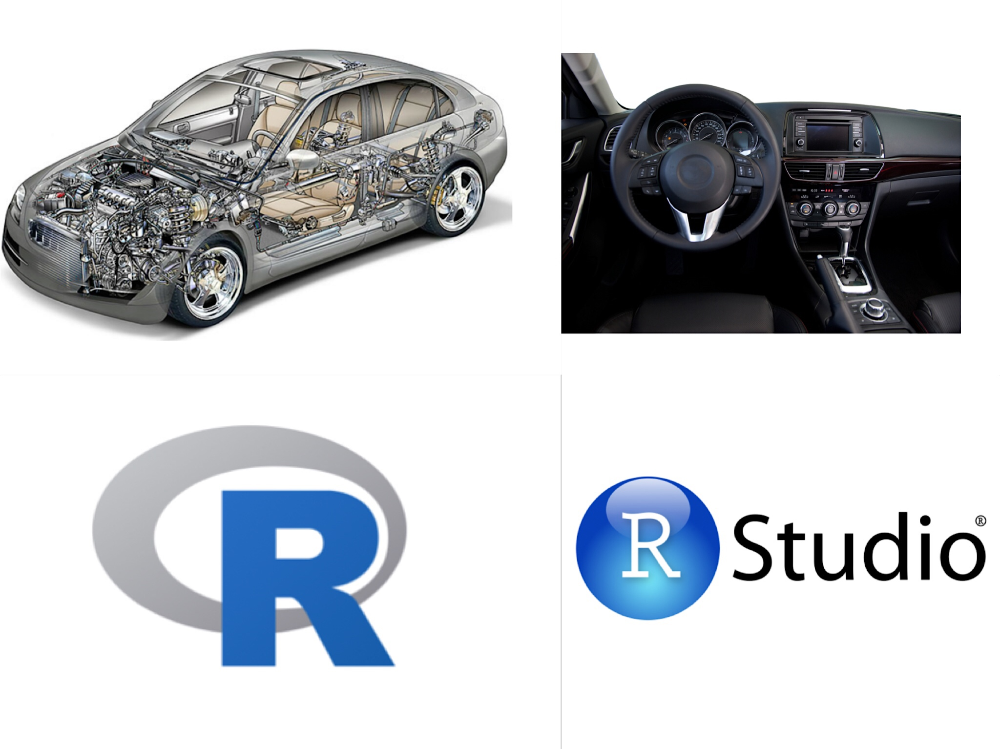{width="80%" height="80%"}


**RStudio help you more efficiently write R language.**


## Project

### Create a Project

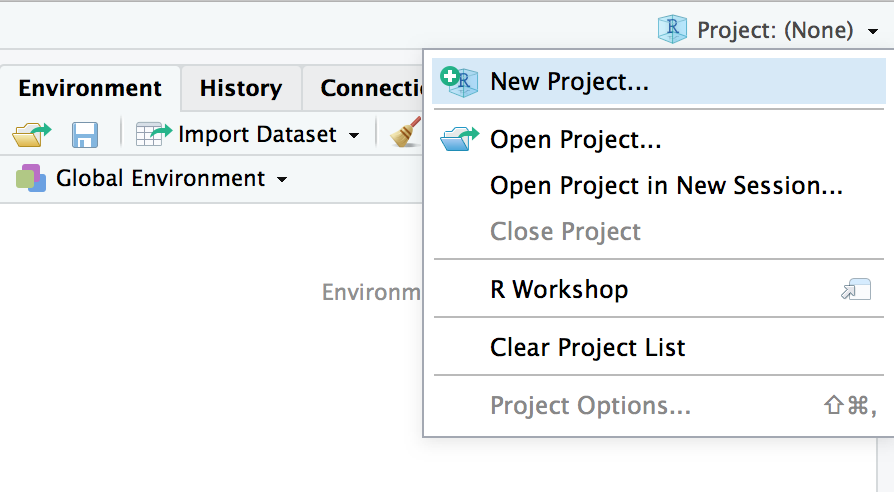{width="50%" height="50%"}

You can name it whatever you want.


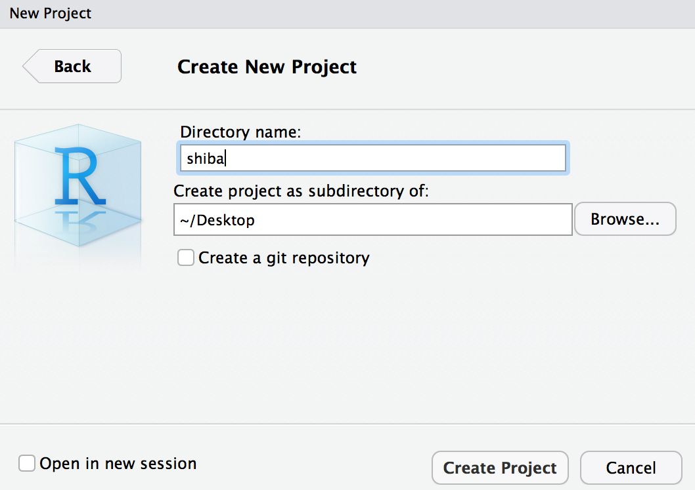{width="50%" height="50%"}

Eg, 

{width="20%" height="20%"}


### Why 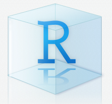{width="7%" height="7%"}?

RStudio projects make it straightforward to divide your work into multiple contexts, each with their own working directory, workspace, history, and source documents.

**Help you bettter organized your work**

[More detail using Project](https://support.rstudio.com/hc/en-us/articles/200526207-Using-Projects)


### What is Working directory?

Suppose you want to bring data form somewhere of your computer into R or save results and figures form R back out to your computer. You need to tell R where the data is or where you want to save the results and figure. R will default your working directory as the "address".

You can find your working directory from your Files pane, for example,

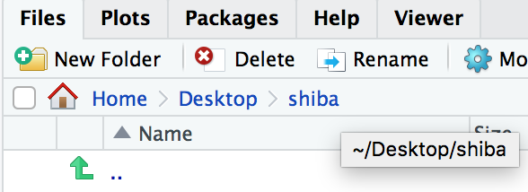{width="50%" height="50%"}

The working directory of this example is `~/Desktop/shiba`

{width="30%" height="30%"}


### Let's try this example

First, create a data directory, `New Folder > data`

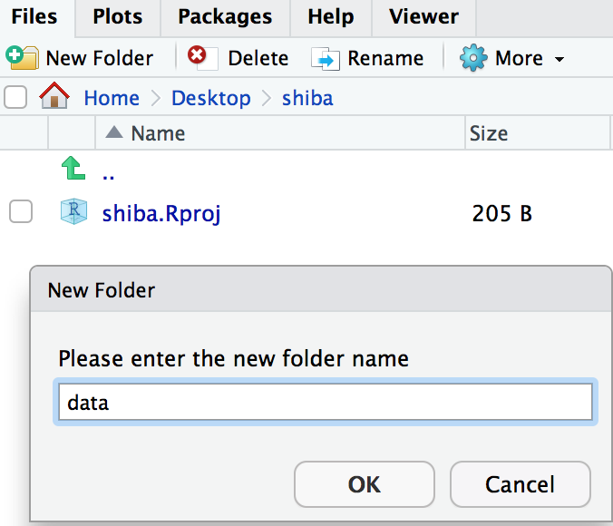{width="40%" height="40%"}

Write down the following command into your Console pane,

```
write.csv(cars, file = "data/cars")
```

Then, type this:

```
read.csv("cars")
```

Oops, try again:

```
read.csv("data/cars")
```

When you try to input the "cars" into R, if you only specify the name of the file. R will assume the file is under your working directory. In this example, working directory is `~/Desktop/shiba`. 

But **"cars"" is under the subdirectory "data" of your working directory**, therefore, the correct "address" of "cars" is under `~/Desktop/shiba/data`.


## Let's write something

(This section is based on http://r4ds.had.co.nz/workflow-basics.html)

In your RStudio console pane, let's tell R to do some things.

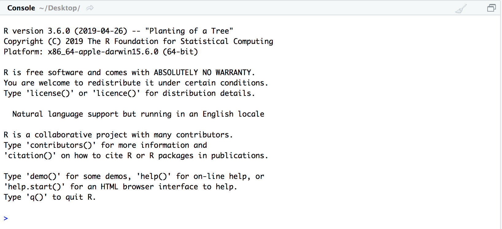{width="50%" height="50%"}


### Calculator

You can use R as a calculator:

```
1 / 200 * 30
(59 + 73 + 2) / 3
sin(pi / 2)
```

### Create objects

**Somthing you want the computer to memorize**

You can create new objects with `<-`:

```
x <- 3 * 4
```

Check your environment pane, and you should see an object called `x`.

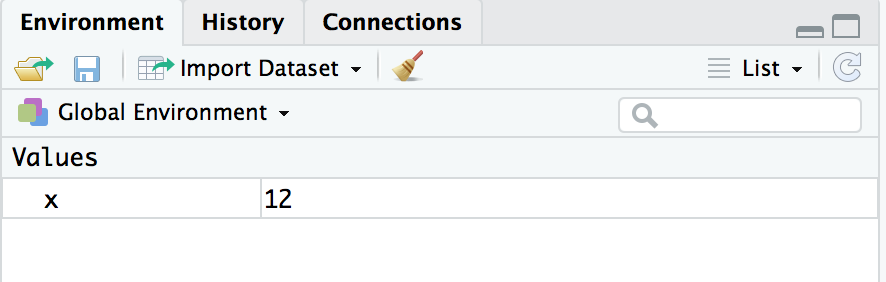{width="50%" height="50%"}


You can inspect an object by typing its name in the console pane:

```
x
```

Make another assignment:

```
this_is_a_really_long_name <- 2.5
```

To inspect this object, try out RStudio’s completion facility: type "this", press TAB, add characters until you have a unique prefix, then press return.

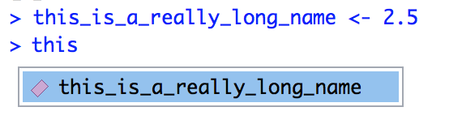{width="50%" height="50%"}


Let's make another object:

```
r_rocks <- 2 ^ 3
```

Now inspect it:

```
r_rock
```

Oops, try again:

```
R_rocks
```

Oops!

**Upper case and lower case is matter in R** 


### Calling functions

R has a large collection of built-in functions that are called like this:

```
function_name(arg1 = val1, arg2 = val2, ...)
```

Let's create a vector of data, and use some functions to compute statistics:

```
x <- c(-1, 4, 2, -2, -1, 0, -4, 10)
mean(x)
median(x)
sd(x)
range(x)
```


## Packages

### What is package and function?

You can consider function as a tool, package is a set of tools to handle specific problems.


### Install packages

There are more than 14400 packages available on the main archive contributed by experts (and relatively new to R people too). There are another several hundred on the bioconductor archive, focused primarily on bioinformatics applications. There are many more on people's github pages, that may be in development.

**You only need to install once**

- From CRAN 
{width="10%" height="10%"}

```{r eval=FALSE, echo=TRUE}
install.packages("ggplot2")
```

- From bioconductor
{width="10%" height="10%"}

```{r eval=FALSE, echo=TRUE}
if (!requireNamespace("BiocManager", quietly = TRUE))
    install.packages("BiocManager")
BiocManager::install("impute")
```


When you install package form Bioconductor, you might be asking the follow question form your Console pane.

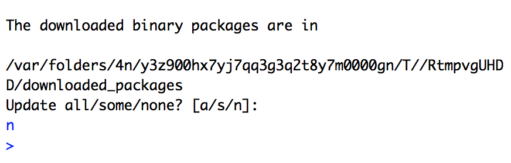{width="60%" height="60%"}

**Enter `n` in your Consolepane**. That is your computor find some of your package can be updated when you installing a package. Normally, we will answer `n`. Because if will greatly increasing the time to update all the packages if answer `a`. And we not necessary require the latest version until your really need it.


- From github repos
{width="10%" height="10%"}

```{r eval=FALSE, echo=TRUE}
devtools::install_github("hadley/emo")
```

### Use packages

**Load once if you need to use the package**

```
library(ggplot2)
```


## Let's make a plot

Type the R command below into your Console pane.

```
ggplot(data = cars, mapping = aes(x = speed, y = dist)) + geom_point()
```

In your Plots pane

{width="50%" height="50%"}


You can press the "Zoom" button to make the plot bigger in a separate window.

{width="50%" height="50%"}


### Need some Help?

Everytime you need some help of the function, you can type "?" and the name of function in the Console pane.

```
?ggplot
```

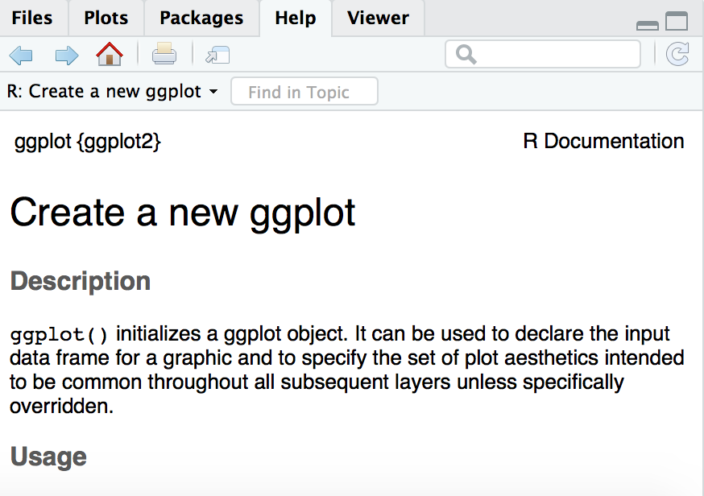{width="50%" height="50%"}


### Cheatsheets

Rstudio provide some guide of quick reference for specific pakage.

Available on [RStudio Cheatsheets](https://www.rstudio.com/resources/cheatsheets/)


##Quit RStudio

Before we quit the RStudio, we modify the below preference of RStudio:

`RStudio > Preferences... > General > Save workspace to .RData on exist: > Never`

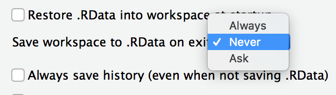{width="50%" height="50%"}


### Quit Rstudio

`RStudio > Quit RStudio`

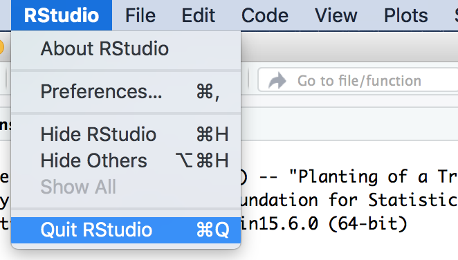{width="50%" height="50%"}


### Reopen RStudio

Look at your Environment pane

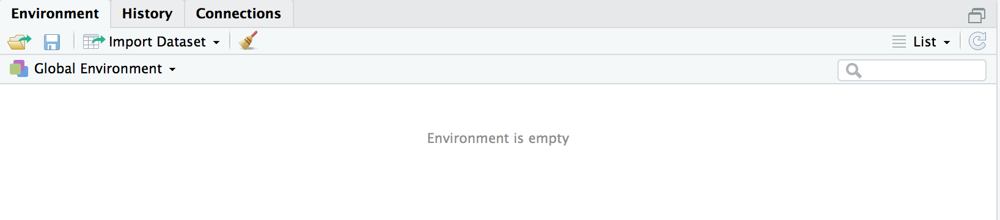{width="80%" height="80%"}

And you Console pane,

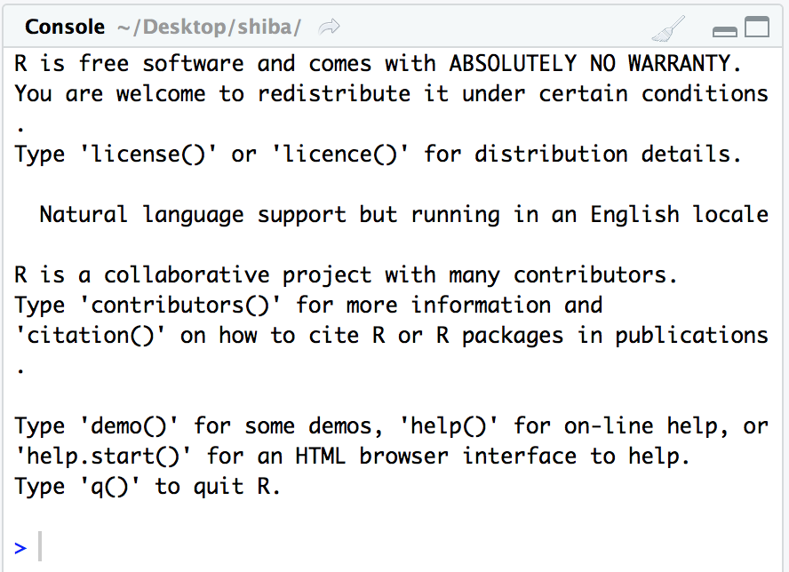{width="50%" height="50%"}

**You created objects and R command has been cleaned**. Then click on `data` from your Files pane.

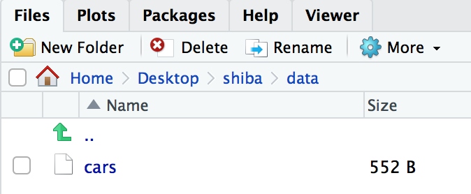{width="50%" height="50%"}

If you want to save your results or figures, you need to "write" it down from R.

#### **Next workshop, we will talk about how to contain plain text, code, results and figures in a single file using R Markdown.**


## Resources

### Cheat Sheets

- [RStudio Cheatsheets](https://www.rstudio.com/resources/cheatsheets/)


### Videos

- [useR! 2018 beginners tutorial: RCurious](https://www.youtube.com/watch?v=AmqxVDlfKQY)

- [RStudio Essntials](https://resources.rstudio.com)


### Blogs

- [R-bloggers](https://www.r-bloggers.com)


