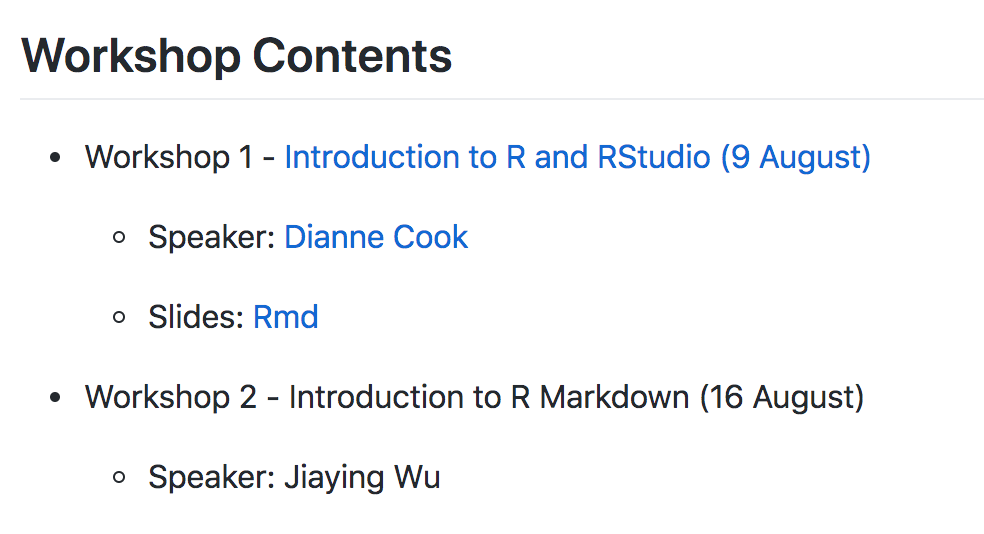
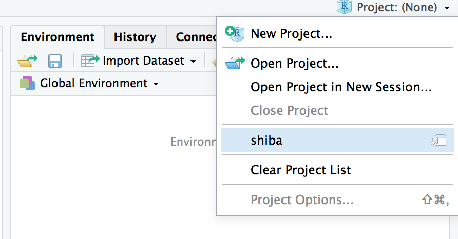
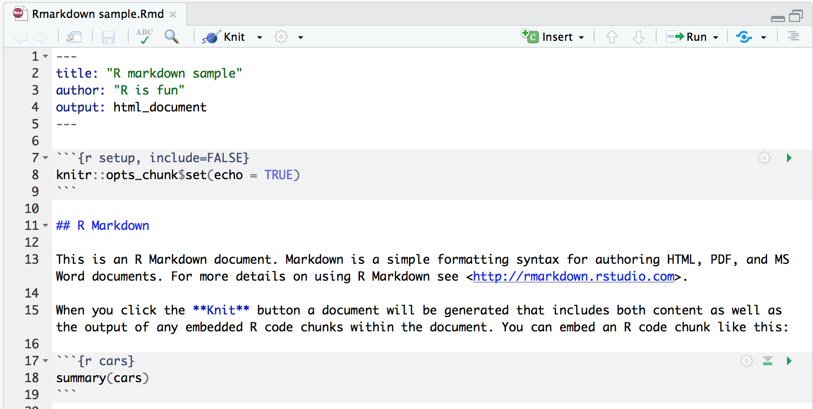
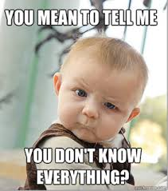
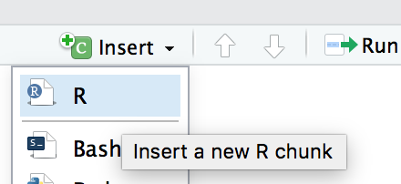
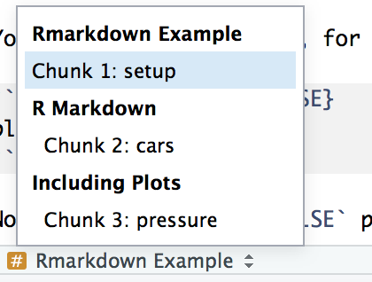
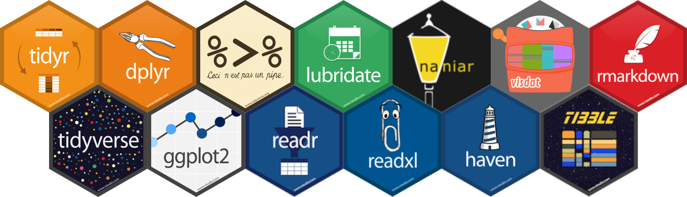

```{r setup, include=FALSE}
library(learnr)
knitr::opts_chunk$set(echo = FALSE,   
                      message = FALSE,
                      warning = FALSE,
                      collapse = TRUE,
                      fig.height = 4,
                      fig.width = 6,
                      fig.align = "center",
                      cache = FALSE)
tutorial_html_dependency()
```

```{r}
# Check wether the pakcages exist and install the rquired pakage
check_package <- function(package_name){
  if(!package_name %in% installed.packages())
    install.packages(package_name)
}

check_package("rmarkdown")
check_package("learnr")
check_package("ggplot2")
check_package("tidyverse")
check_package("rmapshaper")
check_package("sugarbag")
check_package("randomcoloR")
check_package("ggthemes")
```

# Reproducible Reporting

## Set up

#### **Please set up your computer with folowing instructions:**

#### 1. Please enter this link into your web browser : http://bit.ly/MonashBA-R

#### 2. Go down to `Workshop Contents`, then click `Introduction to R Markdown(16 August)` to open the material of workshop 2.

{width="50%" height="50%"}

#### 3. Open your RStudio

#### 4. Open the project you created last week. 

For example, i cretaed a proect name shiba before. Now, i want to open it.

{width="50%" height="50%"}

## Instructors for Workshop 2

#### **Speaker** : Jiaying Wu (Raymond)

#### **Adviser** : [Dr Patricia Menéndez](https://www.patriciamenendez.com/)

####**Helpers** :

* David Kontrobarsky

* Dun Yong Tan

* Geethanjali Gangula

* James Louis Nguyen

* Rowina Nathan

* Sao Yang Hew

* Weihao Li

* Yijia Pan (Jane)

* Zhuangyi Zhu

* Zihui Li (Damon)

Workshop 2 material prepared by : Jiaying Wu, Dianne Cook

#### Workshop Information : http://bit.ly/MonashBA-R


## What is R Markdown?

When you are writing a report and doing analysis with some software, you might need to download your result, write text, and insert the result into your word processor (e.g. Microsoft Word).

But R Markdown allow you embed R code in a Markdown document, produce **textual output** along with **graphics** in a **single file**. 

### A quick tour of R Markdown


### Installation

```
install.packages("rmarkdown")
```

### Create a R Markdown Document

{width="40%" height="40%"}

**You can always switch the output when you generate the output**

{width="40%" height="40%"}

#### Or you can create a R Markdown document by:

`File > New File > R Markdown > Document`

### Notice that the file contains three types of content

{width="80%" height="80%"}

* A YAML header surrounded by `---`

* R code chunks surrounded by `` ``` ``

* text mixed with simple text formatting


## YAML Headers

The top of the R Markdown file sets up the title, author, date and output format to create. It is called YAML, an acronym for "Yet Another Markup Language"! 

YAML has `---` at the top and bottom. For example, 

```
---
title: "Introduction to R Markdown"
author: "R is fun""
output: html_document
---
```

### Produce output

It requires the `knitr` package.

```
install.packages("knitr")
```
### **Explore Time (10 mins)**

You can generate three types of output by:

* HTML: `Knit > Knit HTML`

* Word: `Knit > Knit Word`

* PDF: `Knit > Knit PDF` 

(**PDF output requires LaTeX, it might take significant amount of time to install. Please try it after workshop**)

### Slides for presentations

You can also create a new document that will produce a slide show:

`File > New File > R Markdown > Presentation`


### Flexdashboard document

You may need to install the package 'flexdashboard':

```
install.packages("flexdashboard")
```

#### Create a flexdashboard document:

`File > New File > R Markdown > From template`


### Web app

Create a new web app:

`File > New File > R Markdown > Shiny Web app`


## Markdown syntax

When you knit your file, [Pandoc](https://pandoc.org/MANUAL.html#pandocs-markdown) transforms the marked up text into formatted text in your final file format.

{width="80%" height="80%"}

### **Explore Time (15 mins)**

Type the following markdown language into this website : https://www.markdowntutorial.com/lesson/1/

{width="80%" height="80%"}

### Headings

`#` is a top level heading, or section

`##` is a second level heading, or subsection

`###` is a third level heading, or sub subsection


### Lists

`-` or `*` or `+` on the beginning of several lines makes a bullet list.

You can create a Sub-lists by:

```
* Item A
     + Item a
     * Item aa
- Item B
```

Produces:

* Item A
     + Item a
     * Item aa
- Item B


If you use `1.`, `2.`, … is creates a numbered lists

```
1. Item A
2. Item B
```

Produces:

1. Item A
2. Item B


### Text type

Bold text surrounded by `*` or `-`.

Italicized text surrounded by `**` or `--`.

Strike-through text surrounded by `~~`

For example,

```
Item A

**Item A**

*Item A*

~~Item A~~
```

Produces:

Item A

*Item A*

**Item A**

~~Item A~~


### Create a table

You can create a table in R Markdown. For example:

```
Table Header  Second Header
------------  -------------
Table Cell    Cell 2
Cell 3        Cell 4
```

Produces:

Table Header  Second Header
------------  -------------
Table Cell    Cell 2
Cell 3        Cell 4


### Math

(**Write math in Rmarkdown requires LaTeX, it might take significant amount of time to install. Please try it after workshop**)

It will appear verbatim between `$` characters.

For example:

```
$E = mc^{2}$
```

Produces:

$E = m c^{2}$


More detail about writing math in R Markdown: [Latex Cheatsheet](https://wch.github.io/latexsheet/)


### Insert link

Simply enter the URL, or if you want different text use “[]” around the text followed by () around the link, eg

`[RStudio cheatsheets](https://www.rstudio.com/resources/cheatsheets/)`

produces:

[RStudio cheatsheets](https://www.rstudio.com/resources/cheatsheets/)


### Insert Images

You can insert an image in two way:

* a URL (if the image is hosted online)

* a file path (if the image is saved as a file)

#### By URL:

```

```

**or**

#### By file path:

```

```

Produces:


## Code chunks

Chunks of R code surrounded by `` ``` ``, and the `{r}` specifies that this is R code. You can quickly insert chunks like these into your file with

* the keyboard shortcut: `Ctrl + Alt + I` for general or `command + option + I` for OS X.

* or click "Insert" button in toolbar, then select "R".

{width="30%" height="30%"}


For example, you can include code and plot into your report.

```{r echo=TRUE}
library(ggplot2)
ggplot(data = cars, mapping = aes(x = speed, y = dist)) + 
  geom_point()
```


### Name the chunk

Straight after the `` ```{r `` you can use a text string to name the chunk. This has three advantages:

1. You can more easily navigate to specific chunks using the drop-down code navigator in the bottom-left of the script editor.

{width="30%" height="30%"}

2. Graphics produced by the chunks will have useful names that make them easier to use elsewhere.

3. You can set up networks of cached chunks to avoid re-performing expensive computations on every run. More on that below.

### Chunk option

After you name the chunk, you can also set the behavior of the chunk.

### **Explore Time (10 mins)**

#### Code evaluation

#### `eval = FALSE`

Default value is `TRUE`, if `FALSE`, knitr will not run the code in the code chunk.

#### Results

#### `echo = FALSE`

Default value is `TRUE`, if `FALSE`, knitr will not display the code in the code chunk above it’s results in the final document.

#### `results = hide`

If `hide`, knitr will not display the code’s results in the final document.

#### `message = FALSE`

Default value is `TRUE`, if `FALSE`, knitr will not display any messages generated by the code.

#### `warning = FALSE`

Default value is `TRUE`, if `FALSE`, knitr will not display any warning messages generated by the code.

#### `error = FALSE`

Default value is `TRUE`, if `FALSE`, knitr will not display any error messages generated by the code.

**`error = FALSE` which could be dangerous**


#### Plots

#### `fig.show = 'hide'`

Knitr will generate the plots created in the chunk, but not include them in the final document. 

#### `fig.height = 5` and `fig.width = 5`

The width and height to use in R for plots created by the chunk is 5 (in inches).

#### `fig.align = 'center'` 

Align graphics in the center of final document. other option is `'left'` or `'right'`.


### Global option

You can set all chunk behavior once at the top of the `.Rmd file` using a chunk like:

```
knitr::opts_chunk$set(
  echo = FALSE,
  message = FALSE,
  warning = FALSE,
  fig.width = 4,
  fig.height = 4
)
```

* `echo = FALSE`: hide all the code but keep the result in output file.

* `message = FALSE` and `warning = FALSE` prevents all messages or warnings from appearing in the finished file.

* `fig.width = 4` and `fig.height = 4` set the width and height of all figure in output file as 4.


## Resources

### Online Books

* [R Markdown: The Definitive Guide](https://bookdown.org/yihui/rmarkdown/)

### Cheat sheet

* [R Markdown](https://github.com/rstudio/cheatsheets/raw/master/rmarkdown-2.0.pdf)

* [R Markdown Reference Guide](https://www.rstudio.com/wp-content/uploads/2015/03/rmarkdown-reference.pdf)

* [Latex Cheatsheet](https://wch.github.io/latexsheet/)

### Online course

* [R Markdown form R Studio](https://rmarkdown.rstudio.com/lesson-1.html)

* [Markdown Tutorial](https://www.markdowntutorial.com)

### Video

* [Getting started with R Markdown](https://resources.rstudio.com/the-essentials-of-data-science/getting-started-with-r-markdown-60-02)

* [Reproducible Reporting](https://resources.rstudio.com/the-essentials-of-data-science/reproducible-reporting-58-03)

* [Interactive Reporting](https://resources.rstudio.com/the-essentials-of-data-science/interactive-reporting-60-01)


## Prevue

### **Next workshop** we will talk about **Data Visualization**

```{r map,cache=TRUE,cache.path='cache/',fig.height=8,fig.width=8}
# Library
library(tidyverse)
library(rmapshaper)
library(sugarbag)
library(randomcoloR)
library(ggthemes)

# Simplify and Extract polygons
map_sf <- read_rds(gzcon(url("https://biogeo.ucdavis.edu/data/gadm3.6/Rsf/gadm36_AUS_2_sf.rds")))

map_simplify <- ms_simplify(map_sf, keep = 0.01, keep_shapes = TRUE)

geo_map <- fortify_sfc(map_simplify)

# Assign random color for each local area
df <- data.frame(
  NAME_2 = unique(geo_map$NAME_2), 
  newColor = distinctColorPalette(length(unique(geo_map$NAME_2))),
  stringsAsFactors=FALSE)

# Merge color with data
complete_data <- geo_map %>% left_join(df, by = c("NAME_2" = "NAME_2"))

# Plot map
ggplot(complete_data, aes(x = long, y = lat, group = interaction(GID_2, polygon))) +
  geom_polygon(fill=complete_data$newColor, color="black") +
  theme_map()
```


## Survey and Feedback

### Survey

Please finish the survey **before 18 August 2019**, no personal detail will record within the survey.

**It only take 5 minutes.**

Survey link : https://docs.google.com/forms/d/e/1FAIpQLSeCRbW9K2ruXpHc1qDEhWxKV7Su3Ac7yFcc52oA4zbnKpGiJA/viewform

We will learn how to clean this survey data in Workshop 5 - Data Wrangling 1.

### Feedback

Please provide your feedback for workshop 2, your feedback will help us improve the future experience of workshops.

**3 minutes feedback** : https://docs.google.com/forms/d/e/1FAIpQLSdHG5T4GpxHI9WpfhA-5Xb6w-Mg_28mYT1TNFxKtvuLEV2HSw/viewform

#### Once you finished the survey or feedback, you can collect a hexagonal sticker from the helpers in next Workshop. 

{width="100%" height="100%"}


