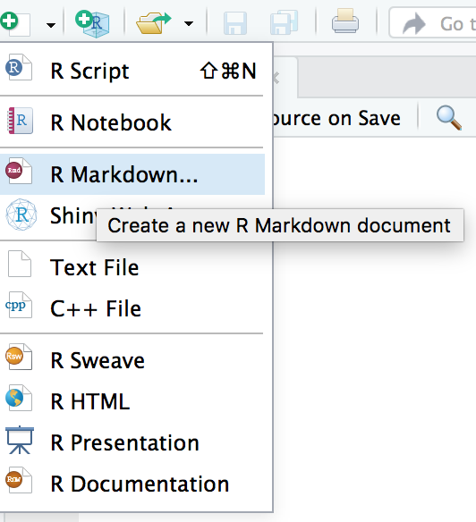
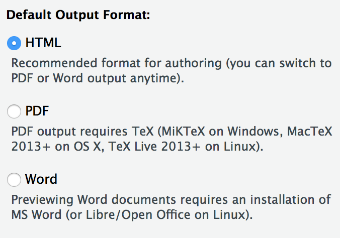

```{r setup, include=FALSE}
# Check wether the pakcages exist and install the rquired packages
check_package <- function(package_name){
  if(!package_name %in% installed.packages())
    install.packages(package_name)
}

check_package("tidyverse")
check_package("learnr")
check_package("ggplot2")
check_package("gridExtra")
check_package("GGally")

knitr::opts_chunk$set(
  echo = TRUE,
  eval = TRUE,
  message = FALSE,
  warning = FALSE)
```

## Set up

#### **Please set up your computer with the following instructions:**

#### 1. Please Open your RStudio

#### 2. Open the project you created before. 

For example, we created a project shiba before. Now, we want to open it.

{width="60%" height="60%"}

#### 3. Create a R Markdown file,

{width="50%" height="50%"}

Then select `HTML` output format.

{width="60%" height="60%"}

#### 4. Enter the link into your web browser : http://bit.ly/MonashBA_R2

#### 5. Go down to `Workshop Contents`, then click `Data Visualisation (23 August)` to open the material of workshop 3.

{width="60%" height="60%"}

#### 6. Click `chocolate.csv` to download the csv file, 

{width="60%" height="60%"}

Then save it under the `data` subdirectory of your project.

{width="60%" height="60%"}


## Instructors for Workshop 5

#### **Speaker** : Yijia Pan (Jane)

####**Helpers** :

* Amy Tran

* David Kontrobarsky

* Dun Yong Tan

* Geethanjali Gangula

* James Louis Nguyen

* Jiaying Wu (Raymond)

* Weihao Li

* William Tran

* Rowina Nathan

* Thi Minh Chau Nguyen

Workshop 3 material prepared by : Yijia Pan, Patricia Menéndez


## Introduction to data visualisation

### Load the packages 

```{r}
library(tidyverse)
library(learnr)
library(ggplot2)
library(gridExtra)
library(readr)
```

An interesting chocolate data set with diverse ingredients in chocolates. Firstly, library `readr` and then use `read_csv()` function to import the chocolate data set.

```{r}
library(readr)
chocolates <- read_csv("data/chocolates.csv")
```

```{r echo = FALSE}
chocolates <- chocolates %>%
  mutate(Contain_Chol = ifelse(Chol_mg > 0, TRUE, FALSE)) %>% 
  mutate(Type = factor(Type))
```

* Different chocolates in rows are our observations and the columns (variables) store information about different aspects of the chocolates.

* Our variables include fiber, fat, calories countries and etc...

```{r}
head(chocolates) 
```

* Use `glimpse()` function to have a look at our data type relative to different variables; The dimension of the data can be seen at the top left 

* You can also use `dim()` function to know the dimension of the data: 88 observations and 15 variables 

* Use `names()` to see the relevant variables  

* Data type: character, factor, double and logical 

```{r}
glimpse(chocolates) 
dim(chocolates)
names(chocolates)
```

### Make a plot by using chocolate data 

* Use `ggplot()` to visualize the data  

* Change the title and the name of x axis by using `ggtitle()` and `xlab()`

```{r plot1}
ggplot(data = chocolates, aes(x = Sugars_g, y = Calories, color = Type)) + 
  geom_point() + 
  ggtitle("The relationship between calories and sugars relative to chocolate types") +
  xlab("Sugars")
```

## Scatter plot

* Using function `geom_point()` in the `ggplot2` package 

* Using mtcars as our data 

### What is mtcars?

* Motor Trend Car Road Tests -- the data was extracted from the 1974 Motor Trend US magazine, and comprises fuel consumption and 10 aspects of automobile design and performance for 32 automobiles (1973–74 models).

* Use `help()` function to find more information 

* Important variables: 
    + mpg -- Miles/(US) gallon
    + cyl -- Number of cylinders
    + wt -- Weight (1000 lbs)
    + vs -- Engine (0 = V-shaped, 1 = straight)
    + am -- Transmission (0 = automatic, 1 = manual)
    + hp -- Gross horsepower
    
```{r}
glimpse(mtcars)
```

### Simple point plot 

The graph indicates that the cars with lower weight tend to use less petrol.

```{r plot2}
ggplot(data = mtcars, aes(x = wt, y = mpg)) + 
  geom_point() +
  xlab("Weight (1000 lbs)") +
  ylab("Miles/(US) gallon")
```

### Color with discrete variable

* Use `factor()` to make `cyl` as a factor 

* `color` is in the `aes()` function 

* The function `labs()` can be used to easily update the legend title for a given aesthetic (fill, color, size, shape, line type, …)

* We can also change the text color and position of the legend as well

The graph shows the miles that cars travel per gallon of gasoline depending on the number of the cylinders they have. Heavy cars tend to have more cylinders and travel fewer distances than light cars with the same amount of gasoline. 

```{r plot3}
p1 <- ggplot(data = mtcars, aes(x = wt, y = mpg, color = factor(cyl))) + 
  geom_point() +
  labs(color = "cyl") +
  xlab("Weight (1000 lbs)") +
  ylab("Miles/(US) gallon")

p2 <- ggplot(data = mtcars, aes(x = wt, y = mpg, color = factor(cyl))) + 
  geom_point() +
  labs(color = "cyl") +
  theme(legend.position = "top",
        legend.title = element_text(color = "blue", size = 10, face = "bold"),
        legend.text = element_text(color = "blue", size = 10, face = "bold")) + 
  xlab("Weight (1000 lbs)") +
  ylab("Miles/(US) gallon")

grid.arrange(p1, p2, nrow = 1)
```

### Color with continuous variable

#### Question: What kind of car tends to have high horsepower?

`scale_color_gradient()` for sequential gradients between two colors

```{r plot4}
ggplot(data = mtcars, aes(x = wt, y = mpg, color = hp)) + 
  geom_point() +
  labs(color = "hp") +
  scale_color_gradient(low="blue", high="red") +
  xlab("Weight (1000 lbs)") +
  ylab("Miles/(US) gallon")
```

### Selecting point color 

```{r plot5}
ggplot(data = mtcars, aes(x = wt, y = mpg)) + 
  geom_point(color = "blue") +
  xlab("Weight (1000 lbs)") +
  ylab("Miles/(US) gallon")
```

### Selecting point shapes

```{r plot6}
ggplot(data = mtcars, aes(x = wt, y = mpg, shape = factor(cyl))) + 
  geom_point() + 
  labs(shape = "cyl") +
  xlab("Weight (1000 lbs)") +
  ylab("Miles/(US) gallon")
```

### Selecting point sizes

```{r plot7}
ggplot(data = mtcars, aes(x = wt, y = mpg, size = factor(cyl))) + 
  geom_point() +
  labs(size = "cyl") +
  xlab("Weight (1000 lbs)") +
  ylab("Miles/(US) gallon")
```

### Selecting point transparency

```{r plot8}
ggplot(data = mtcars, aes(x = wt, y = mpg, alpha = factor(cyl))) + 
  geom_point() + 
  labs(alpha = "cyl") +
  xlab("Weight (1000 lbs)") +
  ylab("Miles/(US) gallon")
```

### Combining color and shape 

#### What you can get from this graph?

```{r plot9}
ggplot(data = mtcars, aes(x = wt, y = mpg, shape = factor(am), color = hp)) + 
  geom_point() +
  labs(x = "Weight (1000 lbs)", y = "Miles per gallon", color = "Gross horsepower") +
  scale_shape_discrete(name = "Transmission", labels = c("automatic", "manual")) +
  scale_color_gradient(low="blue", high="red")
```

* Manual cars have high efficiency of using petrol 

* One manual car has the highest horsepower -- think about sports cars

### Adding a vertical line 

```{r plot10}
ggplot(data = mtcars, aes(x = wt, y = mpg)) + 
  geom_point() +
  geom_vline(xintercept = 3) +
  xlab("Weight (1000 lbs)") +
  ylab("Miles/(US) gallon")

ggplot(data = mtcars, aes(x = wt, y = mpg)) + 
  geom_point() +
  geom_vline(xintercept = 3, linetype = "dotted", 
             color = "blue", size = 1.5) +
  xlab("Weight (1000 lbs)") +
  ylab("Miles/(US) gallon")
```

## Line graph 

### Simple line graph

* Using `mpg` as our data frame and use `help()` function to get more information 

* Fuel economy data from 1999 and 2008 for 38 popular models of car

* Using function `geom_line()`

```{r plot11}
ggplot(data = mpg, aes(x = displ, y = hwy)) + 
  geom_line() +
  xlab("Engine Displacement (Litres)") +
  ylab("Highway Miles per Gallon")
```

## Faceting 

### Using `facet_wrap()`

By using faceting, we can clearly identify the features of cars with different number of cylinders. 

```{r plot12}
ggplot(data = mtcars, aes(x = wt, y = mpg)) + 
  geom_point() + 
  facet_wrap(~cyl)
```

### Using `facet_grid()`

Add facets categorized by multiple variables

```{r plot13}
ggplot(data = mtcars) +
  geom_point(mapping = aes(x = wt, y = mpg)) + 
  facet_grid(cyl ~ am)
```

## Box plot, histogram, bar chart

### Box plot 

* Change the background by using `theme_bw()` function 

* Add color corresponding to `drv` 

* f = front-wheel drive, r = rear wheel drive, 4 = 4wd

```{r plot14}
ggplot(data = mpg, aes(x = drv, y = hwy, fill = drv)) + 
  geom_boxplot() +
  theme_bw()
```

### Histogram 

* Using `binwidth()` to adjust the width of each bin  

* we only need y axis in the `aes()` 

```{r plot15}
ggplot(data = mpg, aes(hwy)) + 
  geom_histogram(binwidth = 0.6) 
```

### Bar chart

```{r plot16}
ggplot(data = mpg, aes(hwy)) + 
  geom_bar()
```

### Count of `drv` in bar chart 

```{r plot17}
ggplot(data = mpg, aes(hwy, fill = drv)) + 
  geom_bar() +
  scale_fill_brewer(palette="Dark2")
```

### Compositional bar charts

When cars are moving using front wheels on highway, they tend to drive more miles per gallon instead of using all 4 wheels or only rear wheels.

```{r plot18}
ggplot(data = mpg, aes(hwy, fill = drv)) + 
  geom_bar(position="fill") +
  scale_fill_brewer(palette="Dark2")
```

### Side-by-side bar charts 

When cars are moving on the highway, they are more likely to use 4 wheels or just front wheels. 

```{r plot19}
ggplot(data = mpg, aes(x = hwy, fill = drv)) + 
  geom_bar(position="dodge") +
  scale_fill_brewer(palette="Dark2")
```

### What can you get from this complicated graph? 

- Different types of cars use different wheels to move as they may have different functions 

- Small cars tend to use petrol more efficiently on highway than large cars 

```{r plot20}
ggplot(data = mpg, aes(x = hwy, fill = drv)) + 
  geom_bar(position="dodge") +
  facet_wrap(~class) +
  scale_fill_brewer(palette="Dark2")
```

## Advanced plotting 

### Non-linear regression 

* Using span to control the "willingness" of the default loess smoother.

* The span is the fraction of points used to fit each local regression.

* Small numbers make a wigglier curve, larger numbers make a smoother curve.

```{r plot21}
p3 <- ggplot(data = mpg, aes(x = displ, y = hwy)) + 
  geom_point() +
  geom_smooth()

p4 <- ggplot(data = mpg, aes(x = displ, y = hwy)) + 
  geom_point() +
  geom_smooth(span = 0.3)

grid.arrange(p3, p4, nrow = 1)
```

### Set `se = FALSE` to get rid of standard error

```{r plot22}
ggplot(data = mpg, aes(x = displ, y = hwy)) + 
  geom_point() +
  geom_smooth(span = 0.3, se = FALSE)
```

### Scatter plot Matrices 

* All variables are supposed to be numerical 

* Rotate the text of x axis in order to be seen clearly 

```{r plot23}
library(GGally)
mtcars %>% 
  mutate(am = factor(am)) %>% 
  ggscatmat(data=.,color = "am", columns=c(1,3,4,5,6,7)) +
  theme(axis.text.x = element_text(angle = 90, hjust = 1))
```


## Feedback

Please provide your feedback for workshop 3, your feedback will help us improve the future experience of workshops.

**3 minutes feedback** : https://docs.google.com/forms/d/e/1FAIpQLScNvF28ZglZt6EHdjKvr8wyJK9tVep85kl1rtGZPb4SydnLHg/viewform

#### Once you finished the survey or feedback, you can collect a hexagonal sticker from the helpers in next Workshop. 

{width="100%" height="100%"}

([R script to neatly align hexagon stickers](https://github.com/mitchelloharawild/hexwall), by Mitchell O'Hara-Wild)
