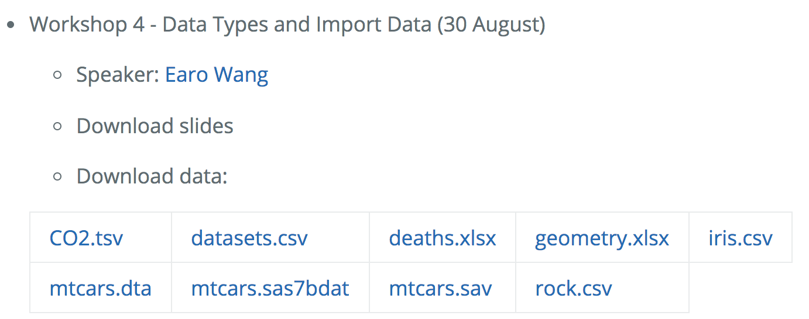

```{r setup, include=FALSE}
# Check wether the pakcages exist and install the rquired packages
check_package <- function(package_name){
  if(!package_name %in% installed.packages())
    install.packages(package_name)
}

check_package("readr")
check_package("readxl")
check_package("tibble")


library(learnr)
knitr::opts_chunk$set(echo = FALSE,   
                      message = FALSE,
                      warning = FALSE,
                      collapse = TRUE,
                      fig.height = 4,
                      fig.width = 6,
                      fig.align = "center",
                      cache = FALSE)
tutorial_html_dependency()
```

```{r library}
library(readr)
```

# Explore Data

## Set up

#### **Please set up your computer with the following instructions:**

#### 1. Please Open your RStudio

#### 2. Open the project you created before. 

For example, we created a project shiba before. Now, we want to open it.

{width="60%" height="60%"}

#### 3. Create a R Markdown file,

{width="50%" height="50%"}

Then select `HTML` output format.

{width="60%" height="60%"}

#### 4. Enter the link into your web browser : http://bit.ly/MonashBA_R2

#### 5. Go down to `Workshop Contents`, then click `Data Types and Import Data (30 August)` to open the material of workshop 4.

{width="90%" height="90%"}

#### 6. Download the following file, 

* `CO2.tsv`

* `datasets.csv`

* `deaths.xlsx`

* `geometry.xlsx`

* `iris.csv`

* `mtcars.dta`

* `mtcars.sas7bdat`

* `mtcars.sav`

* `rock.csv`

then save it under the `data` sub directory of your project.

{width="60%" height="60%"}


## Instructors for Workshop 4

#### **Speaker** : [Earo Wang](https://earo.me)

####**Helpers** :

* Amy Tran

* Dun Yong Tan

* Geethanjali Gangula

* James Louis Nguyen

* Jefanny Suryawan

* Jiaying Wu (Raymond)

* Rachell Ng

* Sao Yang Hew

* Yuru Sun (Christina)

* Yijia Pan (Jane)

* Zihui Li (Damon)

Workshop 4 material prepared by : Jiaying Wu, Patricia Menéndez, Earo Wang


## Data Import and Export

In order to analyze the data with R, **first**, we need to **import the data into R**. Data might save as **difference format**.

{width="70%" height="70%"}

In this workshop we focus on the data save **in disk**.

This is how data save in csv file looks like:

{width="80%" height="80%"}

And this is what we want in R:

```{r}
read_csv("data/chocolates.csv")
```


### Tools

**Data Import and Export** in any software is **crucial** and sometimes **complicated**. In the following workshops, we will learn how to **Import** and **Export** difference format of **data** using these **3 packages**:

* **readr** {width="8%" height="8%"}

* **readxl** {width="8%" height="8%"}

* **haven** {width="8%" height="8%"}


## Common data format

### [**readr**](https://readr.tidyverse.org/index.html) package {width="10%" height="10%"}

**readr** provides a fast and friendly way to read and write **rectangular data** in **R**.


#### What is rectangular data?

Rectangular data refer to a two-dimensional data frame with rows indicating observations and columns indicating variables.


### Installation

```
install.packages("readr")
```

### Load package

```
library(readr)
```

### File end with `.csv`

* [read_csv()](https://readr.tidyverse.org/reference/read_delim.html) : reads **comma separated** files into a tibble.

{width="80%" height="80%"}

[More detail about comma-separated file](https://en.wikipedia.org/wiki/Comma-separated_values)

* [read_csv2()](https://readr.tidyverse.org/reference/read_delim.html) : reads **semicolon separated** files into a tibble, common in countries where `,` is used as the **decimal place**.

{width="80%" height="80%"}


### File end with `.tsv`

* [read_tsv()](https://readr.tidyverse.org/reference/read_delim.html) : reads **tab separated** files into a tibble.

{width="80%" height="80%"}

[More detail about Tab-separated file](https://en.wikipedia.org/wiki/Tab-separated_values)


### File end with `.txt`

* [read_fwf()](https://readr.tidyverse.org/reference/read_fwf.html) : reads **fixed width** files into a tibble.

{width="80%" height="80%"}

[More detail about fixed-width file](https://www.oracle.com/webfolder/technetwork/data-quality/edqhelp/Content/introduction/getting_started/configuring_fixed_width_text_file_formats.htm)


* [read_table()](https://readr.tidyverse.org/reference/read_table.html) : reads a common **variation** of **fixed width files** where columns are **separated by white space**.

### Usage

In order to use these functions to input data into R, you need to specific the path of file to read.

For example, you want to input a comma separated file `rock.csv` into R:

```{r echo=TRUE}
read_csv("data/rock.csv")
```

### Exercise {width="15%" height="15%"}

Import the following files (saved in your `data` sub directory) into R using functions in `readr` package:

* `chocolates.csv`

* `iris.csv`

* `CO2.tsv`

(Hint: same file extension doesn't means the data will save in the same format.)

```{r eval=FALSE}
# chocolates.csv save in comma separated format
chocolates <- read_csv("data/chocolates.csv")

# iris.csv save in semicolon separated format
iris <- read_csv2("data/iris.csv")

# CO2.tsv save in tab separated format
CO2 <- read_tsv("data/CO2.tsv")
```


### Write rectangular files

* [write_csv()](https://readr.tidyverse.org/reference/format_delim.html) : write `.csv` file in comma separated format.

* [write_csv2()](https://readr.tidyverse.org/reference/format_delim.html) : write `.csv` file in semicolon separated format.

* [write_tsv()](https://readr.tidyverse.org/reference/format_delim.html) : write `.tsv` file.


### [**readxl**](https://readxl.tidyverse.org/index.html) package {width="10%" height="10%"}

The **readxl** package makes it easy to get data out of **Excel** and into **R**.


### Installation

```
install.packages("readxl")
```

### Load package

```{r echo=TRUE}
library(readxl)
```

### {width="5%" height="5%"}

### Read Excel file

* [read_xls()](https://readxl.tidyverse.org/reference/read_excel.html) : read legacy format excel file end with `.xls` into a tibble.

* [read_xlsx()](https://readxl.tidyverse.org/reference/read_excel.html) : read xml-based format excel file end with `.xlsx` into a tibble.

* [read_excel()](https://readxl.tidyverse.org/reference/read_excel.html) : both `xls` file and `xlsx` file.

**`read_excel()` will automatically choosing the function for you, use `read_xls()` and `read_xlsx()` directly if you know the path of your excel file.**

### Usage

#### In one excel file, there might exist several spreadsheets.

{width="80%" height="60%"}

#### Suppose you want to input data from spreadsheet `chickwts` of `datasets.xls` into R:

```{r echo=TRUE}
read_xls("data/datasets.xls", sheet = "chickwts")
```

#### Sometimes, data might store in a specific range in Excel and without column name.

{width="80%" height="60%"}

#### Suppose you want to input data within range `B3:D6` of `geometry.xlsx` into R:

```{r echo=TRUE}
read_xlsx("data/geometry.xlsx", range = "B3:D6", col_names = FALSE)
```


### Exercise {width="10%" height="10%"}

Now, please input the data from spreadsheet `other` of `deaths.xlsx` into R.

{width="80%" height="60%"}

```{r eval=FALSE}
read_xlsx("data/deaths.xlsx", sheet = "other", range = "A5:F15")
```


## Uncommon data format

### [**readr**](https://readr.tidyverse.org/index.html) package {width="10%" height="10%"}

#### File end with `.log`

* [read_log()](https://readr.tidyverse.org/reference/read_log.html) : read **web log** files into a tibble.

{width="80%" height="80%"}

[More detail about web log file](https://www.loganalyzer.net/log-analysis-tutorial/what-is-log-file.html)


### [**haven**]((https://haven.tidyverse.org/index.html)) package {width="10%" height="10%"}

**Haven** enables **R** to read and write data various data formats in **SAS**, **SPSS** and **Stata**.


### Installation

```
install.packages("haven")
```


### Load package

```
library(haven)
```


### {width="10%" height="10%"}

#### Read SAS file

* [read_sas()](https://haven.tidyverse.org/reference/read_sas.html) : read SAS file end with `.sas7bdat` or `.sas7bcat` into a tibble.

* [read_xpt()](https://haven.tidyverse.org/reference/read_xpt.html) : read SAS transport files end with `.xpt` (version 5 to 8) into a tibble.


#### Write SAS file

* [write_xpt()](https://haven.tidyverse.org/reference/read_xpt.html) : write `.xpt` file (version 5 to 8).

#### Usage

```
read_sas("data/mtcars.sas7bdat")
write_sas(InsectSprays, "data/InsectSprays.sas7bdat")
```


### {width="10%" height="10%"}

#### Read SPSS file

* [read_sav()](https://haven.tidyverse.org/reference/read_spss.html): read SPSS file end with `.sav` or `.zsav` into a tibble.

* [read_por()](https://haven.tidyverse.org/reference/read_spss.html) : read SPSS file end with `.por` into a tibble.

* [read_spss()](https://haven.tidyverse.org/reference/read_spss.html) : uses either `read_por()` or `read_sav()` based on the file extension.

#### Write SPSS file

* [write_sav()](https://haven.tidyverse.org/reference/read_spss.html) : create `.zsav` file.

#### Usage

```
read_sav("data/mtcars.sav")
write_sav(Indometh, "data/Indometh.sav")
```

### {width="10%" height="10%"}

#### Read Stata file

* [read_dta()](https://haven.tidyverse.org/reference/read_dta.html): read Stata file end with `.dta` (version 8 to 15) into a tibble.


#### Write Stata file

* [write_dta()](https://haven.tidyverse.org/reference/read_dta.html): create `.dta` file (version 8 to 15).

#### Usage

```
read_dta("data/mtcars.dta")
write_dta(trees, "data/trees.dta")
```


## Vector vs List

Now we have learn how to read different format of data into R, and you have hear the words `tibble` again and again. You must wonder what is `tibble`?

{width="20%" height="20%"}

In order to answer this question, first we need to know what is `vector`, `list` and `data frame` in R.


### Vector

Vector can **only** contain the **same type** of elements. it can create by `c()`.

For example:

```{r echo=TRUE}
number <- c(3, 4, 5)
```

You can evaluate the specific element using `[` 

```{r echo=TRUE}
number[1]
```


There are four common types of vectors:

* **double**

* **integer**

* **logical**

* **character**

You can ask R to determine the type of object using `typeof()`.


### Numbers

**Double** vectors sometimes known as **numeric** vectors. Number in R **default** as **double**. when you see a number like `1` in R, which you might think of as integer. The type actually as double. 

```{r echo=TRUE}
typeof(c(1, 2, 3))
```

If you explicitly want an **integer**, you need to add `L` after the number:

```{r echo=TRUE}
typeof(c(1L, 2L, 3L))
```

Or using `:` to generate an integer sequence,

```{r echo=TRUE}
typeof(c(1:3))
```

Integer have one special value `NA`, double have four special value: `NA`, `NaN`, `-Inf` and `Inf`. `NaN` stand for "**Not a Number**" and `Inf` stand for "**Infinite**".

```{r echo=TRUE}
c(-1, 0, 1)/0 
```

### Logical

Logical vector only have three possible value: `TRUE`, `FALSE` and `NA`. We can also use shortcut `T` and `F` as `TRUE` and `FALSE` in R. `NA` is stand for "**Not Available**".

For example:

```{r echo=TRUE}
typeof(c(TRUE, FALSE, T, F, NA))
```


### Character

In R, it a character surrounded by `"`. Each element in a character vector is a **string**, each string can contain any amount of data.

```{r echo=TRUE}
typeof(NA)
typeof("NA")
```


### Factor

In R, factors are used to store categorical data. The different between character and **factor** is we **know all the possible value** of a factor. In a **character vector**, we **don't know** all the possible value.

We can create a factor using function `factor`:

```{r echo=TRUE}
factor(c("yes", "yes", "no", "yes", "no"))
```

The **Levels** of factor default in alphabetical order.

The order of the levels of a factor can be set using the `levels` argument in `factor()`:

```{r echo=TRUE}
factor(c("yes", "yes", "no", "yes", "no"), levels = c("yes", "no"))
```

{width="20%" height="20%"}


### List

List can contain **different type** of elements. we can construct lists using `list()`.

```{r echo=TRUE}
list(c(TRUE, FALSE), 1:3, c(3, 4, 5), "a")
```

A list can also contain another list,

```{r echo=TRUE}
list(1, 2, 3, 4)
```

is not the same as:

```{r echo=TRUE}
list(1, list(2, 3, 4))
```

{width="30%" height="30%"}


**Lists can used to build up more complicated data structures in R.**


## data.frame vs tibble

### Data frame

Data frame is one of the **most common** data structure you’ll deal with in R. It can store **different types** of data in **each column**.

We can create a data frame using the function `data.frame()`, it have the option`stringsAsFactors`. Default as `TRUE`, if you don't want to convert the **character** as **factor**, set it as `FALSE`.

Type these commands below into your **Console** pane:

```
id <- c(101, 102, 103)
name <- c("Mary", "Jack", "Lily")
age <- c(27L, 72L, 45L)
female <- c(TRUE, FALSE, TRUE)
data.frame(id, name, age, female, stringsAsFactors = FALSE)
```
{width="35%" height="35%"}

### What is the connection between vector, list and data frame?

A **Data frame** can consider as a **list** where every element is a **vector** has the **same length**. The **numbers** of **elements** in a list can consider as the numbers of **columns**. The **length** of **one atomic vector** is the numbers of **rows**.


### [Tibble](https://tibble.tidyverse.org)  {width="10%" height="10%"}

`tibble` is also a **data frame**, it tweak some older behaviors of `data.frame`, make it **easier** to analyze large data sets containing complex objects.


#### Installation

```
install.packages("tibble")
```


#### Load library

```{r echo=TRUE}
library(tibble)
```


#### Usage

You can convert an existing object to tibble using `as_tibble()`:

```
as_tibble(iris)
```

Or you can create a new tibble with column vector using `tibble()`, type these commands into your **Console** pane:

```
tibble(id, name, age, female)
```

{width="35%" height="35%"}

Tibble will summary numbers of rows, columns and the type of each column for you.


### `tibble` vs `data.frame`

There are two main differences between `tiblle` and `data.frame`:

* printing

* subseting


### Printing

**Tibble** only print the **first 10 rows**, and the **columns** of data that **fit on screen** (**Not all columns**)

Also **tibble** will tell you the **numbers of rows and columns** of the data set.

Type this command in your **Console** pane:

```
ggplot2::midwest
```

Then type this:

```
as.data.frame(ggplot2::midwest)
```

In the classic `data.frame`, it will print all the columns of your data. Which might looks messy if you working on a large data set.


### Subseting

If you want to **pull out a single variable**, you use these two tools, `$` and `[[`. `[[` can extract by **name or position**; `$` **only** extracts by **name**.

```{r echo=TRUE}
set.seed(001)
xnorm <- rnorm(6)
ynorm <- rnorm(6)

df <- data.frame(xnorm, ynorm)

tb <- tibble(xnorm, ynorm)
```

#### Extract by `$`

```{r echo=TRUE}
df$x

df$xnorm
```

Then try:

```
tb$x
```

Oops!

Try again:

```{r echo=TRUE}
tb$xnorm
```


#### Extract by `[[`

```{r echo=TRUE}
df[[2]]

tb[[2]]

df[["y"]]

tb[["ynorm"]]
```


### Interacting between `data.frame` and `tibble`

You can convert a `data.frame` object into `tibble` using function `as_tibble()`:

```{r echo=TRUE}
class(iris)

class(as_tibble(iris))
```

You can also convert a `tibble` into `data.frame` using function `as.data.frame()`:

```{r echo=TRUE}
class(ggplot2::midwest)

class(as.data.frame(ggplot2::midwest))
```

## Resources

### Online Books

- [R for Data Science](https://r4ds.had.co.nz/)

- [R Programming for Data Science](https://bookdown.org/rdpeng/rprogdatascience/)

- [Advanced R](https://adv-r.hadley.nz/)


### Cheat Sheets

- [RStudio Cheatsheets](https://www.rstudio.com/resources/cheatsheets/)


### Videos

- [Data Science Essntials](https://resources.rstudio.com/the-essentials-of-data-science)

- [useR! 2018 beginners tutorial: RCurious](https://www.youtube.com/watch?v=AmqxVDlfKQY)


### Blogs

- [R-bloggers](https://www.r-bloggers.com)


## Feedback

Please provide your feedback for workshop 4, your feedback will help us improve the future experience of workshops.

**3 minutes feedback** : https://docs.google.com/forms/d/e/1FAIpQLScRjehJX4KTrF03kXFbLwh7Ouiknkhhj_BrnHaGNigthV9vKQ/viewform

#### Once you completed the feedback, you can collect a hexagonal sticker from the helpers in next Workshop. 

{width="100%" height="100%"}

([R script to neatly align hexagon stickers](https://github.com/mitchelloharawild/hexwall), by Mitchell O'Hara-Wild)


