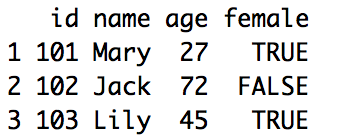
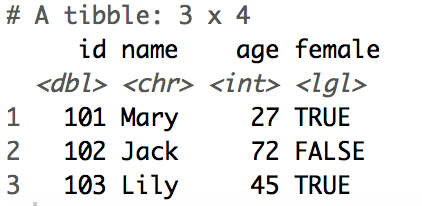

```{r setup, include=FALSE}
library(learnr)
knitr::opts_chunk$set(echo = FALSE,   
                      message = FALSE,
                      warning = FALSE,
                      collapse = TRUE,
                      fig.height = 4,
                      fig.width = 6,
                      fig.align = "center",
                      cache = FALSE)
tutorial_html_dependency()
```

```{r library}
library(readr)
```


# Explore Data

## Vector

In R, there are **two types** of vectors:

1. **atomic vector**

2. **list**

*Vector is a different story in R*

{width="30%" height="30%"}


### Atomic Vector

Atomic vector is a vector can **only** contain the **same type** of elements. Atomic vectors are normally create by `c()`.

Atomic vectors are always flat, even if you nest the `c()`.

```{r echo=TRUE}
c(1, 2, 3)
```

is the as:

```{r echo=TRUE}
c(1, c(2, c(3)))
```

You can evaluate the specific element using `[` 

```{r echo=TRUE}
atomic <- c(3, 4, 5)
atomic[1]
```


There are four common types of atomic vectors:

* **logical**

* **double**

* **integer**

* **character**

You can ask R to determine the type of object using `type()`.


#### Logical

Logical vector only have three possible value: `TRUE`, `FALSE` and `NA`. We can also use shortcut `T` and `F` as `TRUE` and `FALSE` in R. `NA` is stand for "**Not Available**".

For example:

```{r echo=TRUE}
typeof(c(TRUE, FALSE, T, F, NA))
```


#### Numeric

**integer** and **double** vectors are **collectively** known as **numeric** vectors. Number in R default as double. when you see a number like `1` in R, which you might think of as integer. The type actually as double. 

```{r echo=TRUE}
typeof(1)
```

If you explicitly want an integer, you need to add `L` after the number:

```{r echo=TRUE}
typeof(1L)
```

Or using `:` to generate an integer sequence,

```{r echo=TRUE}
typeof(1:3)
```

Integer have one special value `NA`, double have four special value: `NA`, `NaN`, `-Inf` and `Inf`. `NaN` stand for "**Not a Number**" and `Inf` stand for "**Infinite**".

```{r echo=TRUE}
c(-1, 0, 1)/0 
```


#### Character

In R, it a character surrounded by `"`. Each element in a character vector is a **string**, each string can contain any amount of data.

```{r echo=TRUE}
typeof(NA)
typeof("NA")
```


### Factor

In R, factors are used to store categorical data.

### List

List is a vector can contain **different type** of elements. we can construct lists using `list()`.

```{r echo=TRUE}
list(c(TRUE, FALSE), 1:3, c(3, 4, 5), "a")
```

A list can also contain another list,

```{r echo=TRUE}
x <- list(1, 2, 3, 4)
```

is not the same as:

```{r echo=TRUE}
y <- list(1, list(2, list(3, 4)))
```


**Lists can used to build up more complicated data structures in R.**


## Data frame

Data frame is one of the **most common** data structure you’ll deal with in R. Different form matrix, data frame can store **different types** of data in **each column**.

We can create a data frame using the function `data.frame()`, it have the option`stringsAsFactors`. Default as `TRUE`, if you don't want to convert the **character** as **factor**, set it as `FALSE`.

Type these commands below into your **Console** pane:

```
id <- c(101, 102, 103)
name <- c("Mary", "Jack", "Lily")
age <- c(27L, 72L, 45L)
female <- c(TRUE, FALSE, TRUE)
data.frame(id, name, age, female, stringsAsFactors = FALSE)
```
{width="35%" height="35%"}


A **Data frame** can consider as a **list** where every element is a **atomic vector** has the **same length**. The **numbers** of **elements** in a list can consider as the numbers of **columns**. The **length** of **one atomic vector** is the numbers of **rows**.


### [Tibble](https://tibble.tidyverse.org)  {width="10%" height="10%"}

`tibble` is a **data frame**, it tweak some older behaviours of `data.frame`, make it **easier** to analyze large datasets containing complex objects.


#### Installation

```
install.packages("tibble")
```


#### Load library

```{r echo=TRUE}
library(tibble)
```


#### Usage

You can convert an existing object to tibble using `as_tibble()`:

```
as_tibble(iris)
```

Or you can create a new tibble with column vector using `tibble()`, type these commands into your **Console** pane:

```
tibble(id, name, age, female)
```

{width="35%" height="35%"}

Ttibble will summary numbers of rows, columns and the type of each column for you.


### `tibble` vs `data.frame`

There are two main differences between `tiblle` and `data.frame`:

* printing

* subseting

#### Printing

**Tibble** only print the **first 10 rows**, and the **columns** of data that **fit on screen** (**Not all columns**)

Type this command in your **Console** pane:

```
ggplot2::midwest
```

Then type this:

```
as.data.frame(ggplot2::midwest)
```

In the classic `data.frame`, it will print all the columns of your data. Which might looks messy if you working on a large data set.


#### Subseting


## Data Import and Export

In order to analyze the data with R, **first**, we need to **import the data into R**. Data might save as **difference format**.

In this workshop we focus on the data save **in disk**.

{width="70%" height="70%"}

The picture above is "chocolate" data save in comma separated format.


### Workflow

{width="70%" height="70%"}


### Package

**Data Import and Export** in any software is **crucial** and sometimes **complicated**. Thanks for the contributors in R community. The packages they create make our life much easier.

In the following workshops, we will learn how to **Import** and **Export** difference format of **data** using these **3 packages**:

* **readr** {width="8%" height="8%"}

* **readxl** {width="8%" height="8%"}

* **haven** {width="8%" height="8%"}


## [**readr**](https://readr.tidyverse.org/index.html) package {width="10%" height="10%"}

**readr** provides a fast and friendly way to read and write **rectangular data** in **R**.


### What is rectangular data?

Rectangular data refer to a two-dimensional data frame with rows indicating observations and columns indicating variables.


### Load package

```
library(readr)
```


### Read rectangular data

#### File end with `.csv`

* [read_csv()](https://readr.tidyverse.org/reference/read_delim.html) : read **comma separated** files into a tibble.

{width="80%" height="80%"}

[More detail about comma-separated file](https://en.wikipedia.org/wiki/Comma-separated_values)


#### File end with `.tsv`

* [read_tsv()](https://readr.tidyverse.org/reference/read_delim.html) : read **tab separated** files into a tibble.

{width="80%" height="80%"}

[More detail about Tab-separated file](https://en.wikipedia.org/wiki/Tab-separated_values)


#### File end with `.txt`

* [read_fwf()](https://readr.tidyverse.org/reference/read_fwf.html) : read **fixed width** files into a tibble.

{width="80%" height="80%"}

[More detail about fixed-width file](https://www.oracle.com/webfolder/technetwork/data-quality/edqhelp/Content/introduction/getting_started/configuring_fixed_width_text_file_formats.htm)


* [read_table()](https://readr.tidyverse.org/reference/read_table.html) : read **tabular** files where columns are separated by white-space into a tibble.


#### File end with `.log`

* [read_log()](https://readr.tidyverse.org/reference/read_log.html) : read **web log** files into a tibble.

{width="80%" height="80%"}

[More detail about web log file](https://www.loganalyzer.net/log-analysis-tutorial/what-is-log-file.html)


### Write rectangular files

* [write_csv()](https://readr.tidyverse.org/reference/format_delim.html) : write `.csv` file.

* [write_tsv()](https://readr.tidyverse.org/reference/format_delim.html) : write `.tsv` file.


## [**readxl**](https://readxl.tidyverse.org/index.html) package {width="10%" height="10%"}

The **readxl** package makes it easy to get data out of **Excel** and into **R**.


### Installation

```
install.packages("readxl")
```


### Load package

```
library(readxl)
```


### {width="5%" height="5%"}

#### Read Excel file

* [read_xls()](https://readxl.tidyverse.org/reference/read_excel.html) : read legacy format excel file end with `.xls` into a tibble.

* [read_xlsx()](https://readxl.tidyverse.org/reference/read_excel.html) : read xml-based format excel file end with `.xlsx` into a tibble.

* [read_excel()](https://readxl.tidyverse.org/reference/read_excel.html) : both `xls` file and `xlsx` file.

**`read_excel()` will automatically choosing the function for you, use `read_xls()` and `read_xlsx()` directly if you know the path of your excel file.**


## [**haven**]((https://haven.tidyverse.org/index.html)) package {width="10%" height="10%"}

**Haven** enables **R** to read and write data various data formats in **SAS**, **SPSS** and **Stata**.


### Installation

```
install.packages("haven")
```


### Load package

```
library(haven)
```


### {width="10%" height="10%"}

#### Read SAS file

* [read_sas()](https://haven.tidyverse.org/reference/read_sas.html) : read SAS file end with `.sas7bdat` or `.sas7bcat` into a tibble.

* [read_xpt()](https://haven.tidyverse.org/reference/read_xpt.html) : read SAS transport files end with `.xpt` (version 5 to 8) into a tibble.


#### Write SAS file

* [write_xpt()](https://haven.tidyverse.org/reference/read_xpt.html) : write `.xpt` file (version 5 to 8).


### {width="10%" height="10%"}

#### Read SPSS file

* [read_sav()](https://haven.tidyverse.org/reference/read_spss.html): read SPSS file end with `.sav` or `.zsav` into a tibble.

* [read_por()](https://haven.tidyverse.org/reference/read_spss.html) : read SPSS file end with `.por` into a tibble.

* [read_spss()](https://haven.tidyverse.org/reference/read_spss.html) : uses either `read_por()` or `read_sav()` based on the file extension.


#### Write SPSS file

* [write_sav()](https://haven.tidyverse.org/reference/read_spss.html) : create `.zsav` file.


### {width="10%" height="10%"}

#### Read Stata file

* [read_dta()](https://haven.tidyverse.org/reference/read_dta.html): read Stata file end with `.dta` (version 8 to 15) into a tibble.


#### Write Stata file

* [write_dta()](https://haven.tidyverse.org/reference/read_dta.html): create `.dta` file (version 8 to 15).


