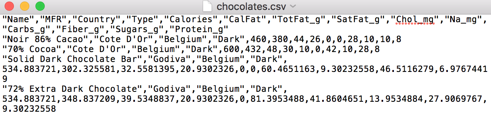
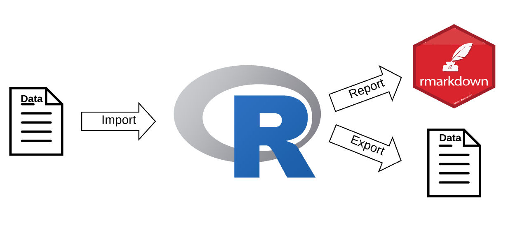

```{r setup, include=FALSE}
library(learnr)
knitr::opts_chunk$set(echo = FALSE,   
                      message = FALSE,
                      warning = FALSE,
                      collapse = TRUE,
                      fig.height = 4,
                      fig.width = 6,
                      fig.align = "center",
                      cache = FALSE)
tutorial_html_dependency()
```

```{r library}
library(readr)
```


# Explore Data

## Data types

There are four common types of atomic vectors:

* double

* integer

* logical 

* character


## Vector vs List


### Atomic Vectors

There are four common types of atomic vectors:

* double

* integer

* logical 

* character


## Data frame vs Tibble


## Data Import and Export

In order to analyze the data with R, **first**, we need to **import the data into R**. Data might save as **difference format**.

In this workshop we focus on the data save **in disk**.

{width="70%" height="70%"}

The picture above is "chocolate" data save in comma separated format.


### Workflow

{width="70%" height="70%"}


### Package

Data Import and Export in any software is crucial and sometimes complicated. Thanks for the contributors in R community. The packages they create make our life much easier.

In the following workshops, we will learn how to Import and Outport difference format of data using these 3 packages:

* **readr** {width="8%" height="8%"}

* **readxl** {width="8%" height="8%"}

* **haven** {width="8%" height="8%"}


## [**readr**](https://readr.tidyverse.org/index.html) package {width="10%" height="10%"}

**readr** provides a fast and friendly way to read and write **rectangular data** in **R**.


### What is rectangular data?

Rectangular data refer to a two-dimensional data frame with rows indicating observations and columns indicating variables.


### Load package

```
library(readr)
```


### Read rectangular data

#### File end with `.csv`

* [`read_csv()`](https://readr.tidyverse.org/reference/read_delim.html) : read **comma separated** files into a tibble.

{width="80%" height="80%"}

[More detail about comma-separated file](https://en.wikipedia.org/wiki/Comma-separated_values)


#### File end with `.tsv`

* [`read_tsv()`](https://readr.tidyverse.org/reference/read_delim.html) : read **tab separated** files into a tibble.

{width="80%" height="80%"}

[More detail about Tab-separated file](https://en.wikipedia.org/wiki/Tab-separated_values)


#### File end with `.txt`

* [`read_fwf()`](https://readr.tidyverse.org/reference/read_fwf.html) : read **fixed width** files into a tibble.

{width="80%" height="80%"}

[More detail about fixed-width file](https://www.oracle.com/webfolder/technetwork/data-quality/edqhelp/Content/introduction/getting_started/configuring_fixed_width_text_file_formats.htm)


* [`read_table()`](https://readr.tidyverse.org/reference/read_table.html) : read **tabular** files where columns are separated by white-space into a tibble.


#### File end with `.log`

* [`read_log()`](https://readr.tidyverse.org/reference/read_log.html) : read **web log** files into a tibble.

{width="80%" height="80%"}

[More detail about web log file](https://www.loganalyzer.net/log-analysis-tutorial/what-is-log-file.html)


### Write rectangular files

* [`write_csv()`](https://readr.tidyverse.org/reference/format_delim.html) : write `.csv` file.

* [`write_tsv()`](https://readr.tidyverse.org/reference/format_delim.html) : write `.tsv` file.


## [**readxl**](https://readxl.tidyverse.org/index.html) package {width="10%" height="10%"}

The **readxl** package makes it easy to get data out of **Excel** and into **R**.


### Installation

```
install.packages("readxl")
```


### Load package

```
library(readxl)
```


### {width="5%" height="5%"}

#### Read Excel file

* [`read_xls()`](https://readxl.tidyverse.org/reference/read_excel.html) : read legacy format excel file end with `.xls` into a tibble.

* [`read_xlsx()`](https://readxl.tidyverse.org/reference/read_excel.html) : read xml-based format excel file end with `.xlsx` into a tibble.

* [`read_excel()`](https://readxl.tidyverse.org/reference/read_excel.html) : both `xls` file and `xlsx` file.

**`read_excel()` will automatically choosing the function for you, use `read_xls()` and `read_xlsx()` directly if you know the path of your excel file.**


## [**haven**]((https://haven.tidyverse.org/index.html)) package {width="10%" height="10%"}

**Haven** enables **R** to read and write data various data formats in **SAS**, **SPSS** and **Stata**.


### Installation

```
install.packages("haven")
```


### Load package

```
library(haven)
```


### {width="10%" height="10%"}

#### Read SAS file

* [`read_sas()`](https://haven.tidyverse.org/reference/read_sas.html) : read SAS file end with `.sas7bdat` or `.sas7bcat` into a tibble.

* [`read_xpt()`](https://haven.tidyverse.org/reference/read_xpt.html) : read SAS transport files end with `.xpt` (version 5 to 8) into a tibble.


#### Write SAS file

* [`write_xpt()`](https://haven.tidyverse.org/reference/read_xpt.html) : write `.xpt` file (version 5 to 8).


### {width="10%" height="10%"}

#### Read SPSS file

* [`read_sav()`](https://haven.tidyverse.org/reference/read_spss.html): read SPSS file end with `.sav` or `.zsav` into a tibble.

* [`read_por()`](https://haven.tidyverse.org/reference/read_spss.html) : read SPSS file end with `.por` into a tibble.

* [`read_spss()`](https://haven.tidyverse.org/reference/read_spss.html) : uses either `read_por()` or `read_sav()` based on the file extension.


#### Write SPSS file

* [`write_sav()`](https://haven.tidyverse.org/reference/read_spss.html) : create `.zsav` file.


### {width="10%" height="10%"}

#### Read Stata file

* [`read_dta()`](https://haven.tidyverse.org/reference/read_dta.html): read Stata file end with `.dta` (version 8 to 15) into a tibble.


#### Write Stata file

* [`write_dta()`](https://haven.tidyverse.org/reference/read_dta.html): create `.dta` file (version 8 to 15).


