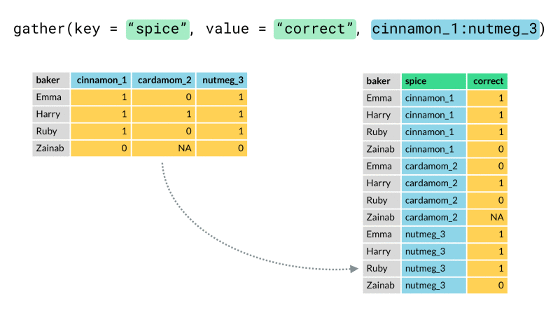
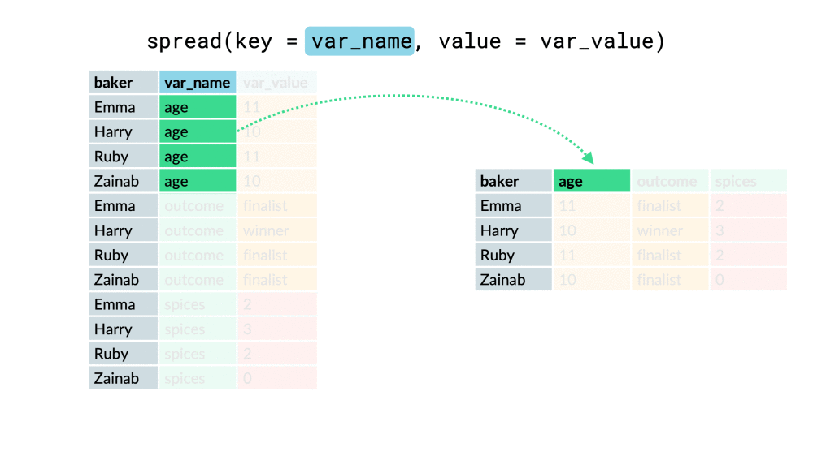

```{r setup, include=FALSE}
# Check wether the pakcages exist and install the rquired packages
check_package <- function(package_name){
  if(!package_name %in% installed.packages())
    install.packages(package_name)
}

check_package("rmarkdown")
check_package("learnr")
check_package("tidyr")
check_package("dplyr")
check_package("stringr")

library(learnr)
knitr::opts_chunk$set(echo = FALSE,   
                      message = FALSE,
                      warning = FALSE,
                      collapse = TRUE,
                      fig.height = 4,
                      fig.width = 6,
                      fig.align = "center",
                      cache = FALSE)
tutorial_html_dependency()
```

```{r data-prep, eval = FALSE}
library(tidyverse)
library(lubridate)
tsibble::tourism %>% 
  group_by(State, Purpose) %>% 
  index_by(Year = year(Quarter)) %>% 
  summarise(Trips = sum(Trips)) %>% 
  ungroup() %>% 
  mutate(State = recode(State,
    `New South Wales` = "NSW",
    `Northern Territory` = "NT",
    `Queensland` = "QLD",
    `South Australia` = "SA",
    `Tasmania` = "TAS",
    `Victoria` = "VIC",
    `Western Australia` = "WA"
  )) %>% 
  unite("what", State, Purpose) %>% 
  spread(what, Trips) %>% 
  write_csv("workshop5/data/tourism.csv")
```

## Survey

**Please scan or click the QR code to finish the survey, we are going to learn how to clean this survey data in the this workshop.**

[{width="60%" height="60%"}](https://docs.google.com/forms/d/1Y-HqDZ6tcJEMc9Y8Ky23Hwv-hQLTJ8jj0tQXsQXRssQ)

## Set up

#### **Please set up your computer with the following instructions:**

1. Please enter the link into your web browser : http://bit.ly/MonashBA_R2

2. Go down to `Workshop Contents`, then click `Data Wrangling 1 (6 September)` to open the material of workshop 5.

{width="60%" height="60%"}

3. Open your RStudio.

4. Open the project you created before.

For example, we created a project shiba before. Now, we want to open it.

{width="60%" height="60%"}

5. Create a R Markdown file,

{width="50%" height="50%"}

Then select `HTML` output format.

{width="60%" height="60%"}


## Instructors for workshop 5

#### **Speaker** : [Mitchell O’Hara-Wild](https://www.mitchelloharawild.com)

#### **Helpers** :

* Amy Tran

* Geethanjali Gangula

* Jefanny Suryawan

* Jiaying Wu (Raymond)

* Sao Yang Hew

* Weihao Li

* William Tran

* Yijia Pan (Jane)

* Yih Ting Eng

* Zihui Li (Damon)

Workshop 5 material prepared by : Mitchell O’Hara-Wild, Jiaying Wu


## Tidy data

### [**tidyr**](https://tidyr.tidyverse.org/) {width="10%" height="10%"}

The goal of `tidyr` is to **reshape** your **data** into **tidy** format.

1. Each variable is in a column.

2. Each observation is a row.

3. Each value is a cell.

{width="100%"}
*The rules of tidy data, R for Data Science* <https://r4ds.had.co.nz/tidy-data.html>

#### Why do we want tidy data?

If the data is arranged into a tidy format, the interesting bits easy to see.

Makes it easy to work with tidyverse packages that have been covered in earlier workshops.

#### Is our survey data tidy?

```{r, eval = FALSE, echo = TRUE}
library(readr)
survey <- read_csv("https://jiaying-wu.github.io/R-Workshops-for-Beginners/workshop5/data/survey_data.csv")
survey
```
```{r, echo = FALSE}
library(readr)
survey <- read_csv("data/survey_data.csv")
survey
```

* What are the variables, observations and values?
* Are the variable names sensible?
* Are the data types correct (think about [last week's workshop](https://ebsmonash.shinyapps.io/workshop4_datatype/))

#### Is this data tidy?
```{r, eval = FALSE, echo = TRUE}
library(readr)
tourism <- read_csv("https://jiaying-wu.github.io/R-Workshops-for-Beginners/workshop5/data/tourism.csv")
tourism
```
```{r, echo = FALSE}
library(readr)
tourism <- read_csv("data/tourism.csv")
tourism
```

#### Data in the wild

Find some data online, is it tidy?

Ideas:

* Data from the ABS
* Australian baby names

{width="50%"}

*Utopia/Distopia by [Dylan Glynn](https://web.archive.org/web/20130501081545/http://www.dylanglynn.com/utopia-dystopia/)*

### How do we make data tidy? {width="6%" height="6%" float="right"}

#### Restructure the columns

* [`gather()`](https://tidyr.tidyverse.org/reference/gather.html): collapses multiple columns into two columns.

{width="80%"}

* [`spread()`](https://tidyr.tidyverse.org/reference/spread.html): takes two columns, and spreads into multiple columns.

{width="80%"}

*[gather() and spread() animations](https://github.com/apreshill/teachthat) by [Alison Hill](https://github.com/apreshill)*

```{r gather, echo = TRUE}
library(tidyr)
tourism <- tourism %>% 
  gather("State_Purpose", "Nights", -Year)
tourism
```

Is this tidy data now?

#### Split and combine columns

* [`separate()`](https://tidyr.tidyverse.org/reference/separate.html): splits a single column into several by some separator.

* [`unite()`](https://tidyr.tidyverse.org/reference/unite.html): combines multiple columns into one by some separator.

```{r separate, echo = TRUE}
tourism <- tourism %>% 
  separate(State_Purpose, into = c("State", "Purpose"), by = "_")
tourism
```

Is this tidy data now?

#### Data within data

* [`nest()`](https://tidyr.tidyverse.org/reference/nest.html): compact a section of data into a cell/value.

* [`unnest()`](https://tidyr.tidyverse.org/reference/unnest.html): expand a dataset into the original data.

```{r nest, echo = TRUE}
tourism <- tourism %>% 
  nest(Year, Purpose, Nights)
tourism
```

Is this tidy data now?

#### Cheat sheet

Click the link to download the pdf file of [tidyr cheat sheet](https://github.com/rstudio/cheatsheets/raw/master/data-import.pdf)


## Data manipulation

### [**dplyr**](https://dplyr.tidyverse.org/) {width="10%" height="10%"}

`dplyr` is a grammar of data manipulation, it provided a set of verbs that help you solve the common data manipulation challenges.

#### What can {width="6%" height="6%"} do?

Five main functions:

* [mutate()](https://dplyr.tidyverse.org/reference/mutate.html): adds new variables that are functions of existing variables.

* [select()](https://dplyr.tidyverse.org/reference/select.html): picks variables based on their names.

* [filter()](https://dplyr.tidyverse.org/reference/filter.html): picks cases based on their values.

* [summarise()](https://dplyr.tidyverse.org/reference/summarise.html): reduces multiple values down to a single summary.

* [arrange()](https://dplyr.tidyverse.org/reference/arrange.html): changes the ordering of the rows.

#### Cheat sheet

Click the link to download the pdf file of [dplyr cheat sheet](https://github.com/rstudio/cheatsheets/raw/master/data-transformation.pdf)


## String manipulation

### [**stringr**](https://stringr.tidyverse.org/) {width="10%" height="10%"}

The `stringr` package provide a set of functions help you easier to working with strings.

#### What can {width="6%" height="6%"} do?

**All functions** in stringr **start with** `str_` and take a vector of strings as the first argument.

Eight useful functions:

* [str_detect(x, pattern)](https://stringr.tidyverse.org/reference/str_detect.html): tells you if there’s any match to the pattern.

* [str_count(x, pattern)](https://stringr.tidyverse.org/reference/str_count.html): counts the number of patterns.

* [str_subset(x, pattern)](https://stringr.tidyverse.org/reference/str_subset.html): extracts the matching components.

* [str_locate(x, pattern)](https://stringr.tidyverse.org/reference/str_locate.html): gives the position of the match.

* [str_extract(x, pattern)](https://stringr.tidyverse.org/reference/str_extract.html): extracts the text of the match.

* [str_match(x, pattern)](https://stringr.tidyverse.org/reference/str_match.html): extracts parts of the match defined by parentheses.

* [str_replace(x, pattern, replacement)](https://stringr.tidyverse.org/reference/str_replace.html): replaces the matches with new text.

* [str_split(x, pattern)](https://stringr.tidyverse.org/reference/str_split.html): splits up a string into multiple pieces.


#### What is a pattern?


#### Cheat sheet

Click the link to download the pdf file of [stringr cheat sheet](https://github.com/rstudio/cheatsheets/raw/master/strings.pdf)


## Analyse survey data

Before we start to analyse, download the following file from this website: http://bit.ly/MonashBA_R2

* Survey description

* Survey Data

Save it into the `data` subdirectory of your project.

{width="60%" height="60%"}

Then


(gif from https://giphy.com/explore/lets-have-some-fun)

## Resources

#### Online Books

- [R for Data Science](https://r4ds.had.co.nz/)

- [R Programming for Data Science](https://bookdown.org/rdpeng/rprogdatascience/)

- [Advanced R](https://adv-r.hadley.nz/)

- [R Markdown: The Definitive Guide](https://bookdown.org/yihui/rmarkdown/)

- [Fundamentals of Data Visualization](https://serialmentor.com/dataviz/)

- [Data Visualization: A practical introduction](https://socviz.co)

- [ggplot2: Elegant Graphics for Data Analysis](https://ggplot2-book.org)

#### RStudio Resources

- [RStudio Cheatsheets](https://www.rstudio.com/resources/cheatsheets/)

- [Data Science Essntials](https://resources.rstudio.com/the-essentials-of-data-science)

- [RStudio webinars](https://github.com/rstudio/webinars)

- [RStudio community](https://community.rstudio.com)

- [R Markdown form R Studio](https://rmarkdown.rstudio.com/lesson-1.html)


#### Other Resources

- [useR! 2018 beginners tutorial: RCurious](https://www.youtube.com/watch?v=AmqxVDlfKQY)

- [R Markdown form R Studio](https://rmarkdown.rstudio.com/lesson-1.html)

- [R-bloggers](https://www.r-bloggers.com)


## Feedback

Please provide your feedback for workshop 5, your feedback will help us improve the future experience of workshops.

**3 minutes feedback** : https://docs.google.com/forms/d/e/1FAIpQLSf-Jv-8kb2sdUXBGul4z-myJ0S4W3dKux-U6aFFLRcg23P20g/viewform

#### Once you completed the feedback, you can collect a hexagonal sticker from the helpers in next Workshop. 

{width="100%" height="100%"}

([R script to neatly align hexagon stickers](https://github.com/mitchelloharawild/hexwall), by Mitchell O'Hara-Wild)


