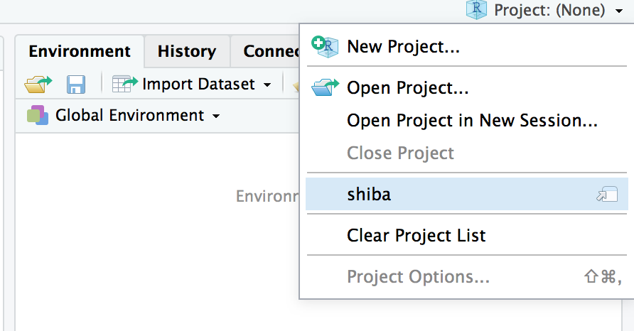

```{r setup, include=FALSE}
# Check wether the pakcages exist and install the rquired packages
check_package <- function(package_name){
  if(!package_name %in% installed.packages())
    install.packages(package_name)
}

check_package("rmarkdown")
check_package("learnr")


library(learnr)
knitr::opts_chunk$set(echo = FALSE,   
                      message = FALSE,
                      warning = FALSE,
                      collapse = TRUE,
                      fig.height = 4,
                      fig.width = 6,
                      fig.align = "center",
                      cache = FALSE)
tutorial_html_dependency()
```


# Data Wrangling

## Survey

### **Please scan the QR code to finish the survey, we are going to learn how to clean this survey data in the this workshop.**

{width="60%" height="60%"}


## Set up

#### **Please set up your computer with the following instructions:**

#### 1. Please enter the link into your web browser : http://bit.ly/MonashBA_R2

#### 2. Go down to `Workshop Contents`, then click `Data Wrangling 1 (6 September)` to open the material of workshop 5.

{width="60%" height="60%"}

#### 3. Open your RStudio

#### 4. Open the project you created before. 

For example, we created a project shiba before. Now, we want to open it.

{width="60%" height="60%"}

#### 5. Create a R Markdown file,

{width="50%" height="50%"}

Then select `HTML` output format.

{width="60%" height="60%"}


## Instructors for Workshop 5

#### **Speaker** : [Mitchell O’Hara-Wild](https://www.mitchelloharawild.com)

####**Helpers** :

* Amy Tran

* Geethanjali Gangula

* Jefanny Suryawan

* Jiaying Wu (Raymond)

* Sao Yang Hew

* Weihao Li

* William Tran

* Yijia Pan (Jane)

* Yih Ting Eng

* Zihui Li (Damon)

Workshop 5 material prepared by : Mitchell O’Hara-Wild, Jiaying Wu


## Resources

#### Online Books

- [R for Data Science](https://r4ds.had.co.nz/)

- [R Programming for Data Science](https://bookdown.org/rdpeng/rprogdatascience/)

- [Advanced R](https://adv-r.hadley.nz/)

- [R Markdown: The Definitive Guide](https://bookdown.org/yihui/rmarkdown/)

- [Fundamentals of Data Visualization](https://serialmentor.com/dataviz/)

- [Data Visualization: A practical introduction](https://socviz.co)

- [ggplot2: Elegant Graphics for Data Analysis](https://ggplot2-book.org)

#### RStudio Resources

- [RStudio Cheatsheets](https://www.rstudio.com/resources/cheatsheets/)

- [Data Science Essntials](https://resources.rstudio.com/the-essentials-of-data-science)

- [RStudio webinars](https://github.com/rstudio/webinars)

- [RStudio community](https://community.rstudio.com)

- [R Markdown form R Studio](https://rmarkdown.rstudio.com/lesson-1.html)


#### Other Resources

- [useR! 2018 beginners tutorial: RCurious](https://www.youtube.com/watch?v=AmqxVDlfKQY)

- [R Markdown form R Studio](https://rmarkdown.rstudio.com/lesson-1.html)

- [R-bloggers](https://www.r-bloggers.com)


## Feedback

Please provide your feedback for workshop 5, your feedback will help us improve the future experience of workshops.

**3 minutes feedback** : https://docs.google.com/forms/d/e/1FAIpQLSf-Jv-8kb2sdUXBGul4z-myJ0S4W3dKux-U6aFFLRcg23P20g/viewform

#### Once you completed the feedback, you can collect a hexagonal sticker from the helpers in next Workshop. 

{width="100%" height="100%"}

([R script to neatly align hexagon stickers](https://github.com/mitchelloharawild/hexwall), by Mitchell O'Hara-Wild)


